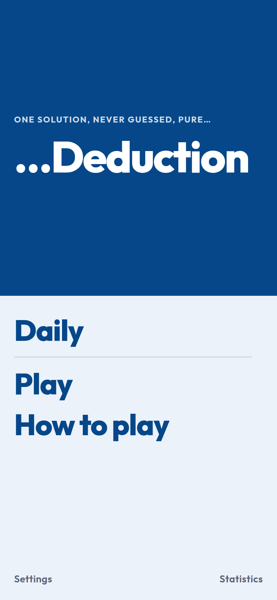
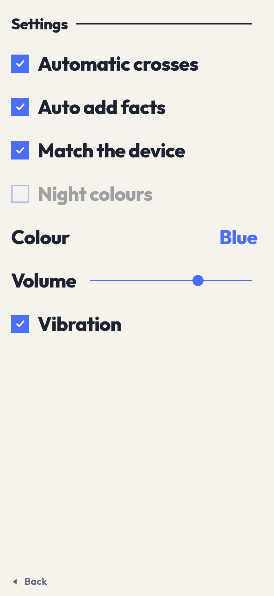
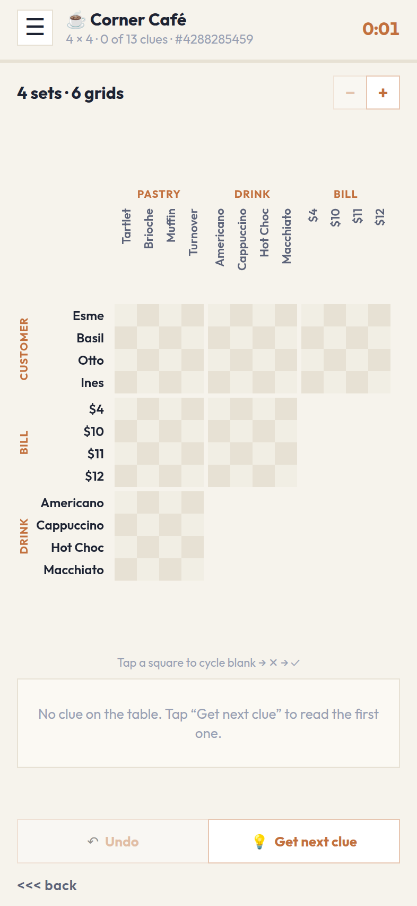
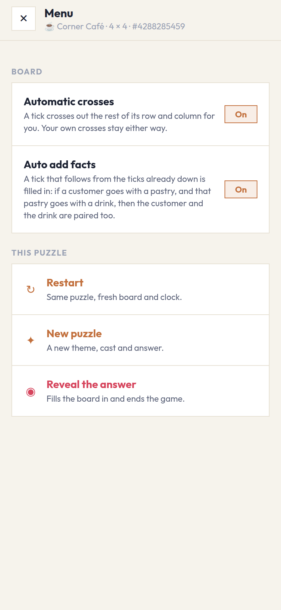
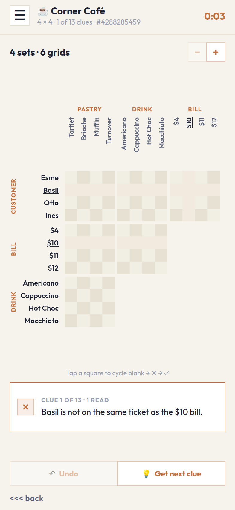
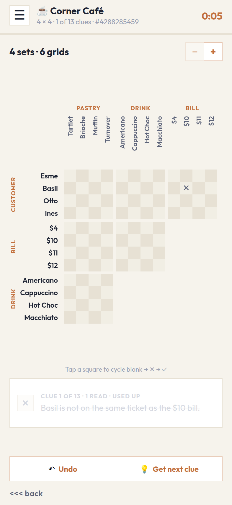
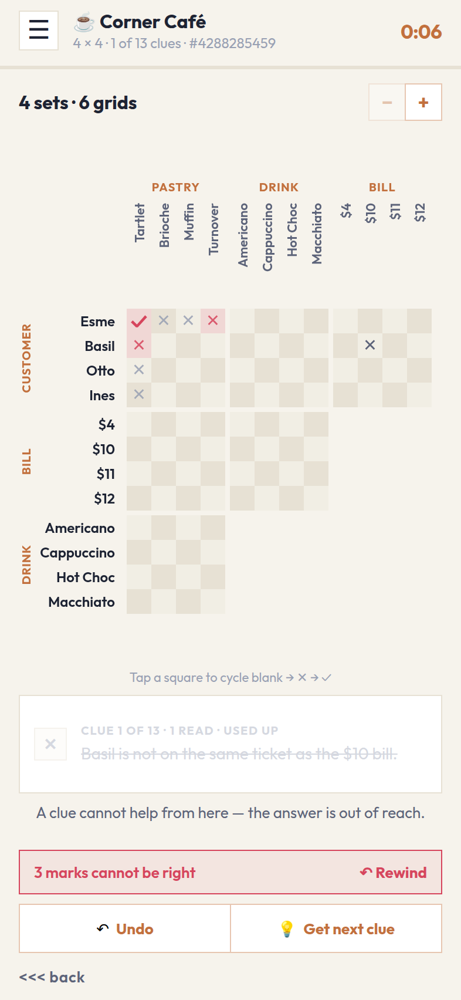
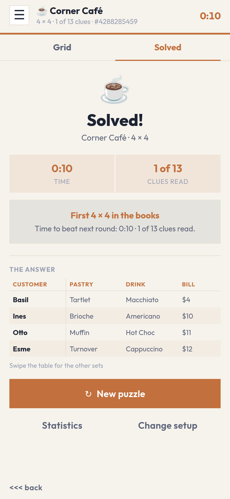
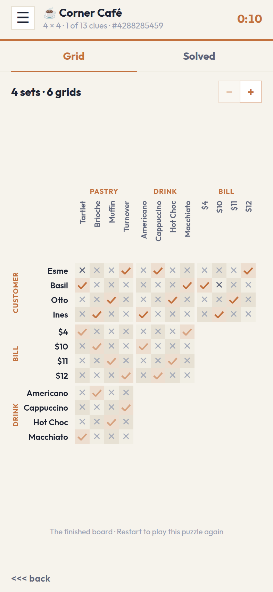
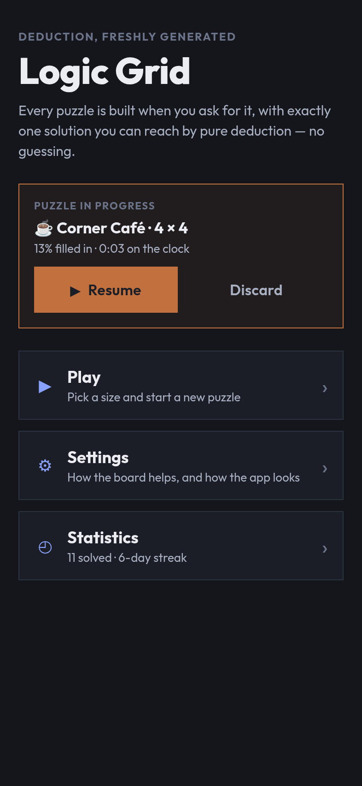

# Logic Grid

An iOS app (React Native + Expo, TypeScript) that generates a fresh logic-grid
deduction puzzle every time you press start. You choose the **grid size**; the
app draws everything else — the theme, the sets in play and the cast of items —
at random.

Every generated puzzle is guaranteed to:

- have exactly one solution, and
- be solvable by pure deduction, so a player never has to guess.

Games in progress survive closing the app, finished games are kept, and the
statistics screen shows whether you are getting quicker.

## Running it

```bash
npm install        # run this again after any pull that changes package.json
npm run ios        # opens the iOS simulator (needs macOS + Xcode)
npm start          # dev server; scan the QR code with Expo Go on a device
npm run web        # browser preview, handy on a machine without Xcode
```

Checks:

```bash
npm test           # jest — puzzle engine, board, storage and statistics
npm run typecheck  # tsc --noEmit
npm run format     # prettier --write .
npm run format:check  # prettier --check . (what CI would ask)
npm run screenshots  # rebuild the screens in docs/screenshots (see below)
npm run sounds     # regenerate the three effects in assets/sounds (see below)
```

Formatting is Prettier's, configured in `.prettierrc.json` — 100 columns and
single quotes, which is what the code was already written to. `npm install`
points `core.hooksPath` at `.githooks`, whose `pre-commit` formats the staged
files and stages the result, so what lands in a commit is always formatted.
`git commit --no-verify` skips it. Two things are left alone: Markdown, because
Prettier pads table cells out to the widest row and the screenshot table here
would become unreadable in source, and the item pools in `src/data/themes.ts`,
which are hand-set as a table and carry a `// prettier-ignore` each. A file
staged in part is formatted whole, since Prettier can only see what is on disk.

If Metro says it cannot resolve a package that is plainly in `package.json`, the
tree on disk is behind the manifest: `npm install`, then `npx expo start -c` to
throw away the bundler's cache.

For a standalone build, use EAS (`npx eas build -p ios`); the bundle identifier
is set in `app.json` and should be changed to your own before building.

## Screens

Captured from the real build at iPhone proportions. **Regenerate these whenever
the UI changes** — `npm run screenshots` — so the reference here always matches
what the app looks like; a change that alters a screen should land with fresh
images in the same commit.

| | | |
|---|---|---|
| <br>**1. Start** — play, settings, statistics, and the game left in progress. | <br>**2. Setup** — the grid size is the only choice; the theme is drawn on start. | <br>**3. Settings** — what the board works out for you, which colours the app draws in, and what it sounds and feels like. |
| <br>**4. Grid** — a 4 × 4 puzzle as a 3 × 3 staircase of six grids, sized to fit the screen. | <br>**5. Menu** — behind the burger: the board settings, and the three ways to leave the puzzle. | <br>**6. Clue** — one clue at a time, under the board, lit up on the grids it talks about. |
| <br>**7. Used up** — mark everything a clue says and it strikes itself through and fades. | <br>**8. Out of reach** — the clue button checks the board first, and offers to rewind when the answer has been marked away. | <br>**9. Solved** — the finish fills the screen on a tab of its own: time, clues read, how it compares, the answer table. |
| <br>**10. Finished board** — the grid tab after the win, one tap from the result. | <br>**11. Statistics** — totals, per-size bests and the trend of recent solve times. | <br>**12. Night** — the same start page in night colours, with a game waiting to be resumed. |

The theme differs from run to run because it is drawn at random, and the
statistics screen is captured with a sample history baked into the script — the
rest is the app behaving normally.

## How you play

1. **Start** — three links: **Play**, **Settings** and **Statistics**, plus the
   game you left in progress if there is one. Play opens the setup screen; pick
   a difficulty and the puzzle starts — there is nothing else to decide, so
   there is nothing else to press. **Beginner** (3 × 3), **Advanced** (4 × 4),
   **Expert** (5 × 4), **Pro** (6 × 4), or **Surprise me!**, which rolls one of
   the four. The shape is what makes the difficulty: the first number is how
   many items each set holds, the second how many sets take part, so a Pro
   puzzle is six items across four sets and six grids to fill. The theme is
   drawn at that moment — one of five settings, its sets and its cast sampled
   from pools of fourteen items each, so two puzzles rarely share a line-up.
2. **Game** — the whole puzzle is drawn as one staircase of grids, the way a
   printed logic puzzle is laid out: every pair of sets meets in its own grid,
   so a four-set puzzle is a 3 × 3 arrangement holding six grids, and each grid
   is items × items. Nothing on the screen scrolls: the board opens at the size
   that fits the space it is given, with the clue in play beneath it. Tap a
   square to cycle it blank → ✕ → ✓. A tick crosses out the rest of its row and
   column for you, and cycling that tick back to blank takes those crosses away
   with it — anything you crossed by hand stays put. **Automatic crosses** and
   **Auto add facts** — which fills in a tick that follows from two others, so a
   pairing carried across a shared entity lands on the board without you copying
   it over — can both be turned off, from the menu or from Settings. The set
   names and item labels stay pinned while the grids scroll sideways, and − / +
   resize the squares past the fit.
3. **Clues arrive one at a time.** **Get next clue** puts one on the table under
   the board; pressing it again replaces it with the next one that still has
   something to say. Tap the clue to light up every row and column it talks
   about. Mark everything it says and the game agrees it is spent: the clue is
   struck through and fades back, and the button skips it from then on. A clue
   you pass over is not gone — the button wraps round to it on a later lap, by
   which time the board may have enough on it for the clue to bite. How many
   clues you read is the score the statistics keep, so working one harder before
   asking for the next is the whole game.
4. **Undo** takes back one mark at a time, autos and all. **Get next clue**
   looks at the board before it hands anything over: a puzzle has one answer, so
   a single mark that contradicts it puts the answer out of reach, and a clue
   read against a board you can no longer solve is a clue wasted. When that has
   happened it says so, marks the squares that cannot be right, and offers
   **Rewind**, which takes moves back until the board can be solved again. The
   timer stops when the last square is right. Finishing adds a second tab,
   **Solved**, which fills the screen with the clock, how many clues it took,
   how the game compares with your earlier ones, and **the answer as a table**:
   one row per person, one column per set, so the whole solution reads across in
   a line. The first set stays pinned while the others scroll sideways, which
   keeps every heading on one line. The board stays where it was, so the
   finished grid is one tap away — though it is read-only from then on, since
   changing it would undo the win.
5. **The menu**, behind the burger at the top left, holds everything that acts
   on the game rather than on a square: the two board settings (the same ones
   the settings screen holds — they are the player's, not the puzzle's),
   **Restart** (same puzzle, fresh board and clock), **New puzzle**, and
   **Reveal the answer**, which is hidden once the puzzle is finished. The
   `<<< back` link at the bottom left leaves for the home screen; the board is
   saved either way.
6. **Settings** — the board pair above; the colours: **night colours** for a
   warm near-black page, and **match the device** to follow the phone's own
   light and dark setting and turn with it; and **sound and feel**: how loud the
   effects are, or off, and whether the phone buzzes with them. They are written
   to disk, so they are the same the next time the app opens.
7. **Come back later** — the board saves itself as you play, so closing the app
   mid-puzzle costs nothing. The home screen offers to resume it, with the clock
   picking up where it left off and the same puzzle in front of you.
8. **Statistics** — solved count, time played, day streak, clues read (in total
   and per puzzle), a per-size table of best and average times, a chart of
   recent solve times, and the list of recent games. Finishing a puzzle shows
   how that time compares with your earlier games at the same size.

## Project layout

```
App.tsx                     screen switching + puzzle generation entry point
scripts/screenshots.mjs     drives the app in a browser to refresh docs/screenshots
scripts/sounds.mjs          synthesises the three effects in assets/sounds
src/data/themes.ts          the five themes: categories, item pools, clue wording
src/data/sizes.ts           the four grid sizes
src/puzzle/types.ts         puzzle, clue and theme model
src/puzzle/rng.ts           seeded PRNG (a seed always rebuilds the same puzzle)
src/puzzle/generator.ts     builds a solution, then a minimal clue set for it
src/puzzle/solver.ts        constraint solver: propagation + search
src/puzzle/describe.ts      clue objects → sentences, using each theme's wording
src/game/board.ts           the player's ticks and crosses, mistakes, win check
src/game/clues.ts           what a clue asks of the board, and which are spent
src/game/layout.ts          the staircase arrangement + the answer table
src/game/persistence.ts     what gets written to disk, and the guards to read it
src/game/usePersistence.ts  saved game + finished games as React state
src/game/time.ts            duration formatting
src/game/useTimer.ts        elapsed-time hook
src/stats/summary.ts        history → per-size stats, streaks, improvement notes
src/storage/store.ts        the only module that touches AsyncStorage
src/components/             GridBoard, SolutionTable, ClueCard, SolvedPanel, …
src/screens/                StartScreen, SetupScreen, SettingsScreen,
                            GameScreen, GameMenuScreen, StatsScreen
src/game/settings.ts        the player's settings, and reading them back
src/game/useSettings.ts     those settings as React state, written as they change
src/ui/                     Text, ThemeProvider (day/night), ScreenHeader,
                            palettes, spacing, borders, sound and haptics
assets/sounds/              the three effects, committed as 16-bit mono WAVs
```

## How the board is laid out

`src/game/layout.ts` turns a set count into the classic arrangement. Sets 1…N-1
run across the top as columns; sets 0, N-1, N-2 … 2 run down the side as rows.
A block is drawn where a row set meets a column set for the first time, which
leaves the familiar staircase:

```
              Destination   Ship     Launch
   Astronaut     ■■■■       ■■■■      ■■■■
   Launch        ■■■■       ■■■■
   Ship          ■■■■
```

Four sets therefore give a 3 × 3 arrangement of six grids, three sets a 2 × 2
arrangement of three, and five sets a 4 × 4 arrangement of ten — every pair of
sets exactly once, which is what makes cross-referencing possible: a tick in
Astronaut × Ship can be carried into Ship × Launch without leaving the board.

## Colours

There are two palettes, `dayPalette` and `nightPalette` in `src/ui/theme.ts`,
and a screen never names a colour — only a role. `ThemeProvider` resolves the
player's preference (day, night, or match the device) against what the device is
actually doing and hands the result down; `useTheme()` reads it. "Match the
device" needs `userInterfaceStyle: "automatic"` in `app.json` to mean anything:
pinned to `light`, iOS tells every app the device is in day colours whatever the
player has set.

`StyleSheet.create` bakes its colours in at the moment it runs, so a stylesheet
written at module scope can never change scheme. Every component writes its
stylesheet as a function of the palette instead — `const makeStyles = (palette)
=> StyleSheet.create({...})` — and calls it through `useStyles`, which builds it
once per palette rather than once per app. Switching schemes is then a context
change, and everything below redraws.

The night palette is not the day one inverted: the ground is a warm near-black
rather than a pure one, the ink is a soft off-white so it does not glare, and
the board's two squares sit a little *lighter* than the page — the same
"printed on the paper" relationship read the other way up, because on a dark
ground it is the ink that has to lift off the page.

## Typography

The typeface is **Outfit**, a geometric sans loaded from
`@expo-google-fonts/outfit`. A custom family has one file per weight and
`fontWeight` cannot pick between them — asking for 700 of a family with no bold
face gets a synthetic one, which smears the letterforms — so `src/ui/Text.tsx`
is a drop-in `Text` that reads the weight out of the style, swaps in the face
that carries it, and drops the weight so nothing is emboldened twice. Every
screen imports `Text` from there rather than from React Native, and `App.tsx`
waits on `useFonts` before drawing so the app never reflows from a system font
to this one. Swapping typeface means changing the package, the five names in
`App.tsx`, and the map in `Text.tsx`.

Nothing in the app is rounded: the `radius` scale in `src/ui/theme.ts` is zero
throughout. Where bordered neighbours do sit flush they carry `joinLeft` /
`joinTop`, a one-pixel negative margin that makes the two share a single edge
rather than each drawing its own. Grid blocks, menu rows and
the toolbar buttons sit flush, so a group of them reads as one ruled table the
way a printed puzzle page does. That is for parts of one thing, though, not for
things that are separately readable: the statistics screen keeps its spacing —
between its cards and between its stat tiles — and so do the two rows that mark
a chosen item, the grid sizes on the home screen and the size filter on the
statistics screen, where a shared edge would paint over the selection's own
border.

There are no lines on the board at all. Inside a block the squares alternate
white and a shade, like a checkerboard, and that shading is what keeps a row
readable across the grid; around each block is a two-pixel band painted in the
page colour, so what separates one grid from the next is a gutter of background
rather than a rule. Both squares sit a little deeper than the page —
`boardLight` at L\* 94.1 and `boardShade` at 89.7 against the page's 95.9 — so
the grid reads as printing on the paper rather than paper laid on it. Near-white
squares on a deeper page were tried and shimmered; tinting the squares instead
is calm at every size. A block's box carries that band on each side and is measured
to suit — `blockBox = cellSize * items +
2 * BLOCK_BORDER` — so the squares inside come out at exactly `cellSize` and
line up with the labels beside them, and `fitCellSize` allows for the rules when
it sizes the board.

The game screen is one fixed-height layout: the staircase, the clue in play
beneath it, and the toolbar pinned below that. Nothing about it scrolls.
`fitCellSize` measures the space actually left for the board — width *and*
height, from an `onLayout` on the board area rather than from the window — and
picks the largest cell whose whole staircase fits it. The zoom buttons go up
from there, and only a board zoomed past its fit scrolls, in whichever direction
it outgrew. `ClueCard` carries a fixed minimum height and shows at most three
lines, so a long clue replacing a short one cannot resize the board under the
player's finger.

`isSolvable` is `findMistakes` read the other way round: a puzzle has exactly
one answer, so a mark the answer contradicts is a mark nothing later can put
right. That is what **Get next clue** tests before handing one
over and what Rewind pops the undo stack towards; `clearMistakes` is the fallback for a board whose history has run
out — a resumed game starts with an empty stack, so its undo history begins
where the player picked it up. The stack itself is session-only and holds the
last 200 boards.

Winning adds a tab rather than covering the board. There is no tab bar during
play — there is only the board to show — so the bar appears at the finish with
**Grid** and **Solved** in it, `SolvedPanel` fills the body, and the win selects
it. Everything the finish made pointless goes with it — the clue card, the Undo
and clue buttons, and the menu's "Reveal the answer" row are all hidden — and
the board becomes read-only, because a stray tap on a finished grid would undo
the win, restart the clock and have the game counted a second time.

## Clues, one at a time

There is no clue list. **Get next clue** puts one clue under the board and the
next press replaces it, which makes reading a clue a decision — and the number
of them the statistics keep.

`src/game/clues.ts` decides when a clue is spent. `clueMarks` returns the
squares one clue forces *given the board as it stands*, which is the same thing
a player does when they re-read a clue after learning something: a plain link
wants its tick or its cross; an either-or wants a cross on every option it
leaves out, and names the survivor once the other is ruled out; a comparison
separates the two entities it names and rules out the values at either end of
the scale that nothing left on the other side could sit beyond. Because the
board is read on the way in, the answer is a fixpoint — once every mark it lists
is down, running it again lists the same ones and no more — so `clueDone` is
simply "are they all there", and `cluesDone` is the set of clues the board has
caught up with.

Only what the clue itself says is counted. The crosses that follow from a tick,
and the tick that follows from the last blank in a row, are the grid's rules
rather than the clue's, and the board fills those in on its own. Who marked a
square makes no difference either: a cross the board added counts as much as one
the player made, which is what lets a single tick finish several clues at once.

`nextClue` walks on from the clue on the table and wraps round, skipping the
ones that are done, so a clue passed over early comes back on a later lap once
the board has enough on it for it to bite; `null` means every clue is used up.
The clue card strikes a spent clue through and fades it to 40% over 700ms rather
than whipping it away, so the player sees which one they just finished.

A property test pins both ends of this down: on an empty board no clue counts as
done, and on a solved board every one of them does.

In `src/game/board.ts` every square records who marked it. A tap by the player
is a `hand` mark; a cross the board adds because a tick rules out the rest of
its row and column is an `auto` mark that remembers the tick it came `from`.
`reconcile` rebuilds the automatic crosses around the hand marks after every
change, and only ever fills a square the player has left alone.

That distinction is the whole point: cycling a tick back to blank drops the
crosses it added, but a cross the player placed by hand stays put — even one the
tick would also have implied, since the tick never claimed that square in the
first place. It is also what lets either board setting be switched off and on
again without touching anything the player did.

`reconcile` works in the order the reasoning goes. **Auto add facts** comes
first: a tick says two attributes belong to one entity, so the ticks read as
edges and every connected group is one entity, whose members are all paired with
each other — that is how `A1 × B3` and `B3 × C2` put a tick on `A1 × C2`, and it
carries chains of any length, in any direction, not just the three-step case.
Then **Automatic crosses** rules out the rest of the row and column of every
tick, worked out ones included. Two attributes from the same set can only land
in one group on a board that has already gone wrong, and those pairs are left
alone rather than marked with a pairing that cannot exist.

`solutionRows` in the same module produces the end-of-game summary: one row per
entity and one column per set, ordered by the ordered set (earliest year,
cheapest bill…) so it reads like the answer key of a printed puzzle. The table
pins its first column and scrolls the rest, so set names never have to wrap.

## Sound and feel

Three effects and three haptics, behind one module. `src/ui/feedback.ts`
exposes `feedback.tap`, `.mark`, `.success` and `.warn`; a call site says what
happened — a navigation item was pressed, a square was marked, a puzzle was
finished, a board went wrong — and never which file to play or which motor to
run. `tap` is a selection buzz and a soft click, `mark` a light impact and a
shorter, brighter one, `success` a success notification and a rising arpeggio,
and `warn` is haptic only, because the app has nothing pleasant to say and
saying it twice would be worse.

Both are niceties, so every path swallows its own failure: a device with no
haptic motor, a simulator with no speaker, or a player that will not load costs
the effect and nothing else. The players are built on the first sound asked for,
not at import, and the audio mode marks these as effects rather than media —
they mix with whatever the player is listening to instead of interrupting it,
and they respect the silent switch, because a puzzle game chirping through a
muted phone is a bug.

The settings live in a module-level value rather than a context. These fire from
event handlers on nearly every screen, and threading a provider through all of
them would buy nothing; `App` keeps that value in step with the stored settings
from an effect. **Volume** is four steps (off, quiet, medium, loud) and
**Vibration** is a switch — off means silent, and off on both means a game that
makes no noise at all. Turning the volume down plays the tap at the volume being
left behind, since that is the one the player just heard.

The sounds are synthesised rather than sampled: `npm run sounds` writes
`assets/sounds/{tap,mark,success}.wav` from `scripts/sounds.mjs` — three short
tones from one scale (E5, A5, and the A major triad), shaped by the same
envelope, so they sit together as one voice and the repository carries no audio
it did not make. The WAVs are committed, so a normal build never runs it.
Swapping one for a real recording means dropping a 16-bit mono WAV of the same
name into that folder; nothing reads those numbers at runtime.

## How the puzzle engine works

A puzzle has `size` **entities** and a handful of **categories**. Each entity
owns exactly one item from every category and no item is shared, so a solution
is just one permutation per category. Category 0 (the people) is pinned to the
identity permutation, which stops the same arrangement being counted twice under
a relabelling of entities.

**Generating** (`generator.ts`):

1. Draw a theme from the pool, then its categories — always including one ordered
   category (a year, a price, a depth…) so comparison clues are possible — then
   sample the items each category contributes and roll a random solution. Every
   one of those draws comes from the seeded generator, so a seed rebuilds the
   whole puzzle, cast included.
2. Build a pool of clues that are all *true* of that solution:
   - `A is paired with B` / `A is not paired with B`
   - `A is paired with either B or C`
   - `The depth for A is deeper than for B`, optionally with an exact gap
3. Add clues one at a time until propagation alone cracks the grid.
4. Try removing every clue in turn, keeping the removal whenever the puzzle is
   still deducible. What is left is a minimal clue set.

Link clues — the plain *is* and *is not* statements the grid is drawn for — make
up **at least three quarters** of every finished puzzle. That is not something
the offer order can promise on its own, because which clues survive is decided
by the deduction rather than by the pool: a single comparison can do the work of
five crosses and stay in. So the generator spaces the flavour clues out among
the links, drops a redundant comparison before a redundant link when it
minimises, and if the mix still comes out short it builds the puzzle again with
the flavour thinner — down to links alone, which always clears the bar. A few
direct matches lead the pool, since a puzzle carried by links alone otherwise
needs half as many clues again to reach the same certainty.

**Solving** (`solver.ts`) keeps a candidate bitmask per (category, entity) in a
flat `Int32Array` and alternates:

- *propagation* — an item belongs to one entity and an entity to one item, plus
  one rule per clue kind, run to a fixpoint;
- *search* — branch on the most constrained cell, used by `solve()` when
  counting solutions.

Step 3 of generation deliberately uses the propagation-only entry point
(`solveByDeduction`). If pure propagation reaches a full grid, the answer is
provably unique *and* a player can reach it the same way — no guessing, no
backtracking. It is also much cheaper than proving uniqueness by exhaustive
search, which keeps generation at a few hundred milliseconds even for the 6 × 4
expert grids. `solve()` still exists for the tests, which independently confirm
that each generated puzzle has exactly one solution.

### Clue wording

The sentences clues are written in belong to the themes, not to the code. Each
theme can supply templates for the five kinds of clue, filled from named slots:

| Slot | Meaning |
|---|---|
| `{a}` `{b}` `{c}` | the attributes a link or either-or clue names |
| `{greater}` `{lesser}` | the two sides of a comparison |
| `{noun}` | what the ordered set is called, e.g. "launch year" |
| `{comparative}` | which way it runs, e.g. "later" |
| `{gap}` `{unit}` | the exact difference, e.g. "3" and "years" |

So Cosmic Voyage says

```ts
clues: {
  link: '{a} shares a mission with {b}.',
  compare: '{greater} launches {comparative} than {lesser}.',
  compareGap: '{greater} launches exactly {gap} {unit} {comparative} than {lesser}.',
  …
}
```

and reads "The Kestrel launches later than Milo", while Reef Dive says "The
Pipefish spotter went exactly 18 metres deeper than Nico" and Mythic Quest
"Wren is not the Minotaur slayer".

Anything a theme leaves out falls back to `DEFAULT_CLUE_TEMPLATES` in
`describe.ts` ("{a} is paired with {b}."), so a new theme can ship without
writing any of them. `resolveClueTemplates` merges the two at generation and
stores the result on the puzzle, which means a saved game keeps the wording it
was played with even if the theme is rewritten later. A test holds every
template to the slots its clue needs — dropping `{b}` from a link would quietly
halve the clue — and to a capital letter and a full stop.

The item `pattern` on each category (`the {} mission`) is what those slots are
filled with, so the two are written together: change the voice and the patterns
usually want a look as well.

### Seeds

Every new puzzle is given a freshly rolled 32-bit seed, and that seed decides
everything the player did not choose: which theme is drawn, which of its sets
play, which items are sampled from their pools, the solution, and the clues.
`generatePuzzle({ theme, size, seed })` with the same seed and size rebuilds an
identical puzzle — a test asserts exactly that, which is what makes the seed a
fair name for a puzzle rather than a debugging curiosity.

The seed is therefore never re-rolled for a puzzle already in play:

| Action | Seed |
|---|---|
| Start puzzle / New puzzle | a new random seed |
| **Restart** | unchanged — same theme, sets, items, answer and clues; only the board and the clock start over |
| **Resume** | unchanged — the saved puzzle is stored whole and comes back as it was, clock included |

The current seed is printed at the foot of the game screen, so a puzzle worth
repeating can be identified.

## Persistence and statistics

Two things are stored, both under AsyncStorage, both versioned:

| Key | Holds |
|-----|-------|
| `logic-grid:saved-game:v1` | the puzzle in progress: the whole puzzle, every tick and cross, which clues have been read and which is on the table, elapsed seconds |
| `logic-grid:history:v1` | the last 300 finished games: time, clues read, how many the puzzle had, theme, size, whether it was revealed |

The saved game stores the generated puzzle itself rather than its seed, so a
game in progress keeps playing exactly as it was even if the themes or the
generator change in a later version.

`src/storage/store.ts` is the only module that talks to AsyncStorage. Reads run
through the guards in `persistence.ts`, so data from an older version, a
half-written file, or a corrupt value reads as "nothing saved" instead of
crashing; writes are wrapped too, so a device that refuses to write costs the
player their save and nothing more. The board is written 600ms after each
change, when the app goes to the background, and when the player leaves the
screen; finishing a puzzle clears it.

`src/stats/summary.ts` derives everything shown from the list of finished games
— nothing aggregated is stored, so the numbers can never drift out of sync with
the games behind them. Revealed puzzles are recorded but kept out of the times.
Games finished before clues were counted store `null` rather than a zero, and
are left out of the clue averages instead of flattering them: hints and clues
were different measures, so the old number is not read as the new one.
Improvement is measured two ways: `improvementFor` compares a game just
finished with earlier games at the same size (personal best, share faster than
average, rank), and `statsForSize` compares the last five solves with the five
before them for the longer-run trend the chart draws.

## Notes

- The five themes live entirely in `src/data/themes.ts`. Adding one is a matter
  of listing five categories with a pool of items each, marking the ordered
  category, giving each category a `pattern` used to phrase clues
  (`the {} mission`), and optionally a `clues` block to give the theme its own
  voice. The pools hold fourteen items apiece — well over the six a
  6 × 4 puzzle uses — which is what makes the draw feel fresh; a test keeps every
  pool deep, distinct and short enough to fit the grid headings.
- No backend and no analytics: everything is kept on the device, and clearing
  the statistics from the stats screen deletes it.
- `npm run sounds` rewrites the three WAVs in `assets/sounds` from
  `scripts/sounds.mjs`. They are committed, so this is only needed after
  changing how one of them is built.
- `npm run screenshots` exports the app for web, serves that build, drives it in
  Chromium and rewrites `docs/screenshots`. Playwright's Chromium arrives with
  the dev dependencies (`npx playwright install chromium` if the download was
  skipped); `PLAYWRIGHT_CHROMIUM_PATH` points it at another binary, and
  `--skip-build` reuses the last export. **Treat the images as part of the
  build**: regenerate them alongside any change that alters a screen, so the
  README never shows a version of the app that no longer exists.
- `react-dom` / `react-native-web` are installed only so `npm run web` can give
  a quick preview away from a Mac; nothing in the app is web-specific.
