# Deduction

An iOS app (React Native + Expo, TypeScript) that generates a fresh logic-grid
deduction puzzle every time you press start. You choose the **grid size**; the
app draws everything else — the theme, the sets in play and the cast of items —
at random.

Every generated puzzle is guaranteed to:

- have exactly one solution, and
- be solvable by pure deduction, so a player never has to guess.

Games in progress survive closing the app, finished games are kept, and the
statistics screen shows whether you are getting quicker.

## Running it

```bash
npm install        # run this again after any pull that changes package.json
npm run ios        # opens the iOS simulator (needs macOS + Xcode)
npm start          # dev server; scan the QR code with Expo Go on a device
npm run web        # browser preview, handy on a machine without Xcode
npm run build:ios  # a signed .ipa from EAS — see "Onto an iPhone" below
```

Checks:

```bash
npm test           # jest — puzzle engine, board, storage and statistics
npm run typecheck  # tsc --noEmit
npm run format     # prettier --write .
npm run format:check  # prettier --check . (what CI would ask)
npm run screenshots  # rebuild the screens in docs/screenshots (see below)
npm run sounds     # regenerate the three effects in assets/sounds (see below)
npm run icons      # redraw assets/icons and rebuild the path data (see below)
```

Formatting is Prettier's, configured in `.prettierrc.json` — 100 columns and
single quotes, which is what the code was already written to. `npm install`
points `core.hooksPath` at `.githooks`, whose `pre-commit` formats the staged
files and stages the result, so what lands in a commit is always formatted.
`git commit --no-verify` skips it. Two things are left alone: Markdown, because
Prettier pads table cells out to the widest row and the screenshot table here
would become unreadable in source, and the item pools in `src/data/themes.ts`,
which are hand-set as a table and carry a `// prettier-ignore` each. A file
staged in part is formatted whole, since Prettier can only see what is on disk.

If Metro says it cannot resolve a package that is plainly in `package.json`, the
tree on disk is behind the manifest: `npm install`, then `npx expo start -c` to
throw away the bundler's cache.

## Onto an iPhone

Three ways, cheapest first. The first needs nothing but the phone.

**1. Expo Go — no build, no Apple account.** Every native module the app uses
(`expo-audio`, `expo-haptics`, `expo-font`, `async-storage`, `react-native-svg`,
`react-native-safe-area-context`) ships inside Expo Go, so the app runs there as
it is:

```bash
npm start                     # then scan the QR code with the iPhone's camera
npm start -- --tunnel         # if the phone is not on the same network
```

Install **Expo Go** from the App Store first. This is the fastest way to look at
a change on real hardware, and the JS reloads as you edit. What it cannot show
you is the app's own icon, its splash screen, or how it behaves when it is not a
guest inside another app.

**2. A signed build you keep — EAS, `preview` profile.** This produces an `.ipa`
that installs on registered devices and survives being closed:

```bash
npm run eas:login             # an Expo account, free
npm run build:ios             # a signed build on Expo's Macs
```

The CLI is not installed — the scripts reach it with `npx eas-cli`, which
fetches it on demand. Its own messages say to run `eas login` and `eas build`;
those work only if you have installed it globally (`npm i -g eas-cli`), so use
the scripts or put `npx` in front.

The first run asks for an Apple ID and offers to create the signing certificate,
the provisioning profile and the App ID for you; say yes to all three. It also
asks which devices to provision — `npx eas-cli device:create` registers an
iPhone by UDID, which the phone gives up by opening the link EAS shows you. The
build runs on Expo's Macs and hands back a URL; open it on the registered phone
and it installs.

An **Apple Developer Program membership** is needed for this — ad-hoc
distribution is not something a free Apple ID can do. The alternative is
TestFlight (`npx eas-cli build --platform ios --profile production` then
`npx eas-cli submit --platform ios`), which needs the same membership but no
UDIDs and gives up to 10,000 testers.

**3. Your own Mac.** With Xcode installed, `npx expo run:ios --device` generates
the native project, builds it and installs it over the cable. A free Apple ID
can sign this one, though the app expires after seven days.

### "Developer Mode is needed"

A phone thing, not a build thing. Since iOS 16 a device will install a
development-signed app and then refuse to launch it until Developer Mode is
turned on. On the phone: **Settings → Privacy & Security → Developer Mode**,
switch it on, let it restart, then tap **Turn On** at the prompt and enter the
passcode. The menu only appears once such an app has been installed, and the
setting sticks — it is asked for once per device, not once per build.

Ad-hoc builds do not ask for it, so being asked says the build was signed with a
development profile: a development-client build (`npm run build:ios:dev`), one
installed from Xcode, or a `preview` build whose credentials EAS took from a
free Apple ID rather than a paid team. `npx eas-cli credentials` says which
profile a build was signed with.

Whichever route: **the bundle identifier is `com.mattonfoot.deduction`**, set in
`app.json`. It has to be unique across the App Store and match the team the
build is signed by, so change it before the first build if that is not yours —
after the first build it is what identifies the app, and changing it makes a
different app.

`/ios` and `/android` are not in the repo. Expo generates them from `app.json`
whenever a build needs them, so the config is the source of truth and there is
no native project to keep in step by hand. `npx expo prebuild --platform ios`
writes one out if you want to look at it.

## Dependencies

**The Expo SDK decides the versions, not npm.** Everything with a native side —
React, React Native, and the `expo-*`, `react-native-*` and AsyncStorage
packages — is pinned to what the SDK in use was built and tested against, which
is often behind what npm calls latest. The list lives in
`node_modules/expo/bundledNativeModules.json`, and `npx expo install --check`
compares the manifest with it. Upgrading one of those on its own is how a
managed app ends up with a JS package its native build does not match; they move
together, when the SDK does.

Two more that are held back on purpose:

- **jest 29.** `jest-expo` 57 is built on jest 29 — its dependencies name
  `babel-jest`, `jest-environment-jsdom` and `jest-snapshot` at `^29`, and
  running the 30 runner over them mixes two versions of jest in one process.
  It goes up when `jest-expo` does, and `@types/jest` follows it.
- **`react` and `react-dom` at an exact 19.2.3**, the pair the SDK ships and
  `react-test-renderer` is pinned to. A patch on one side only is the version
  skew React warns about, so neither carries a range.

Everything without a native side — TypeScript, Prettier, Playwright — tracks
latest.

### Security

`npm audit` is clean apart from one advisory that has no fix published:

| | |
|---|---|
| **uuid** (moderate, `<11.1.1`) | Fixed with an `overrides` entry in `package.json`. It arrives under `xcode`, which asks for `^7` and is four levels below anything this repo depends on directly, so an override is the only way to move it. `xcode` uses `uuid.v4()` to number the entries of a generated Xcode project, which the named exports of 14.x still cover. |
| **image-size** (high, DoS in the ICNS, JXL and HEIF parsers) | No patched version exists — the advisory covers every release up to and including the current one. It comes in under Metro, which reads the dimensions of the images in `assets/` while bundling: build-time only, never shipped in the app, and the only images it is ever handed are the ones in this repository. Nothing to do but wait for a release; there is no override that fixes it, and forcing the 2.x major on Metro would break asset handling without clearing the advisory. |

## Screens

Captured from the real build at iPhone proportions. **Regenerate these whenever
the UI changes** — `npm run screenshots` — so the reference here always matches
what the app looks like; a change that alters a screen should land with fresh
images in the same commit.

| | | |
|---|---|---|
| <br>**1. Start** — the name on a panel of the link colour, **Daily** and **Play** under it with a rule between, and the two side doors at the foot. | <br>**2. Difficulty** — the same panel, the same half; only what is under it changes. | 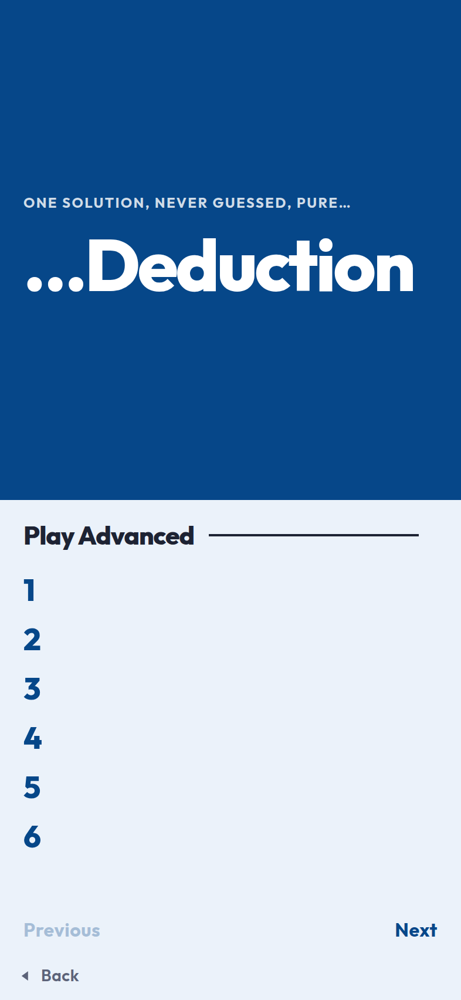<br>**3. Numbered puzzles** — every puzzle at that difficulty, counting from one, six to a page, each with a box that ticks when you finish it and your time beside it. |
| 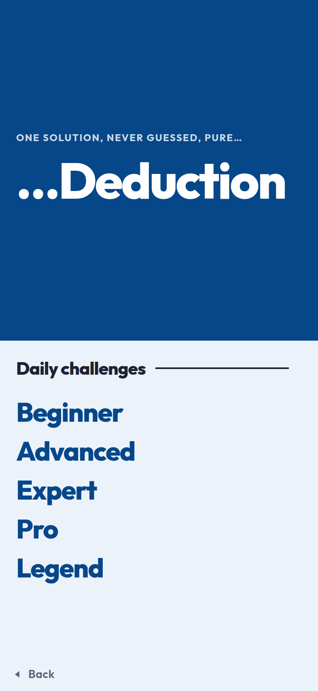<br>**4. Daily** — today's four, one per difficulty. A finished one shows its time and opens the result instead of a board. | 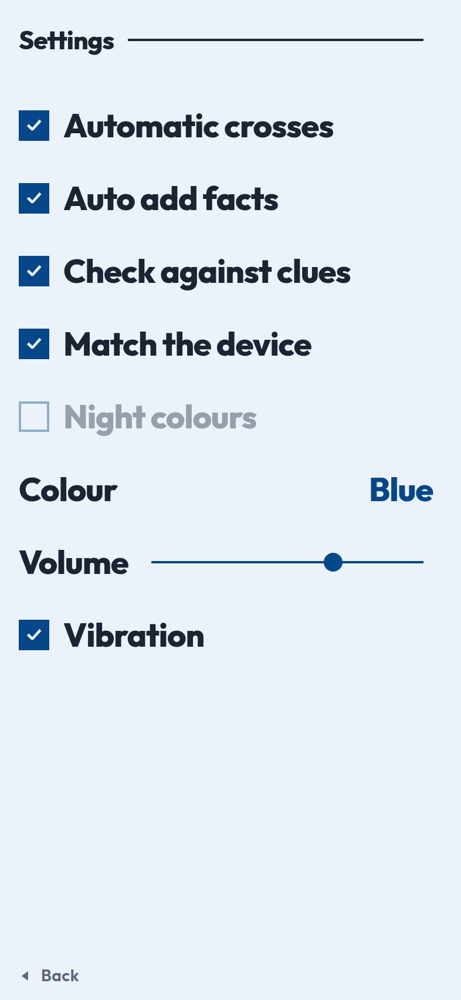<br>**5. Settings** — seven names with a box or a slider against each, and nothing to read. | 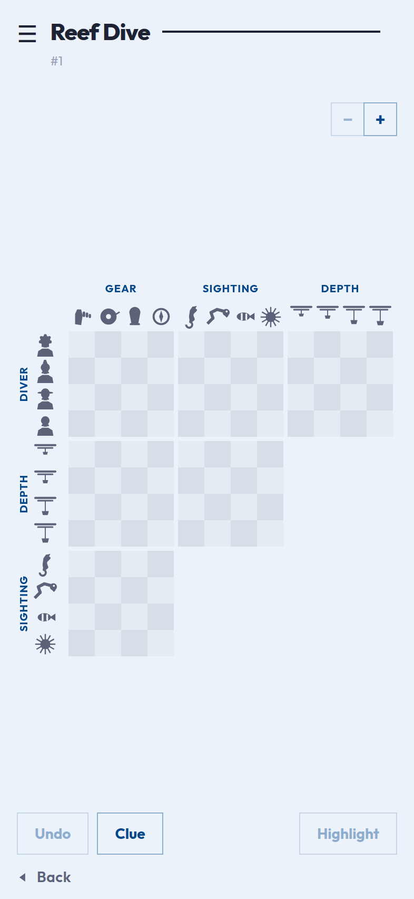<br>**6. Grid** — a 4 × 4 puzzle as a 3 × 3 staircase of six grids, sized to fit the screen. |
| 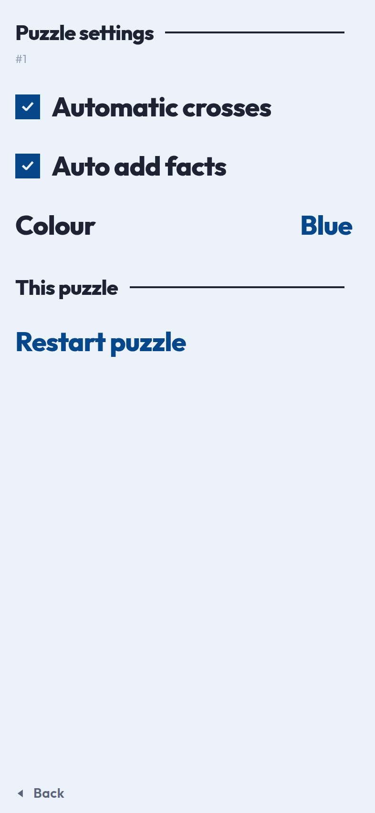<br>**7. Puzzle settings** — behind the burger: the board pair and the colour, set the way the settings screen sets them, then starting this one over. | 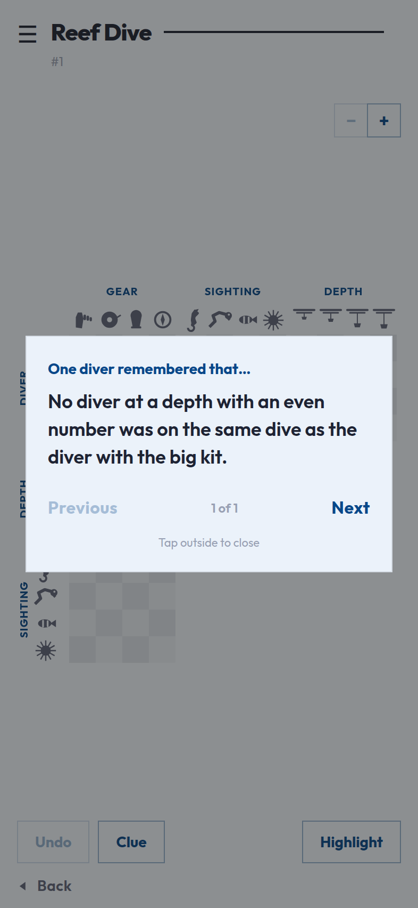<br>**8. Clue** — one clue at a time, in a window with the room to read it, under a line saying who is supposed to have said it, and the pair that moves between the ones you have read. | 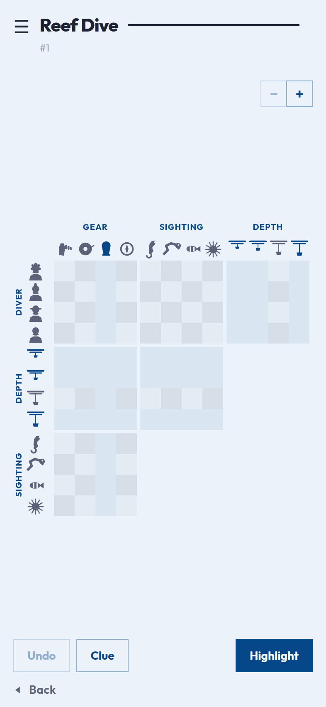<br>**9. Highlight** — the button at the bottom right lights every row and column the clue talks about. |
| 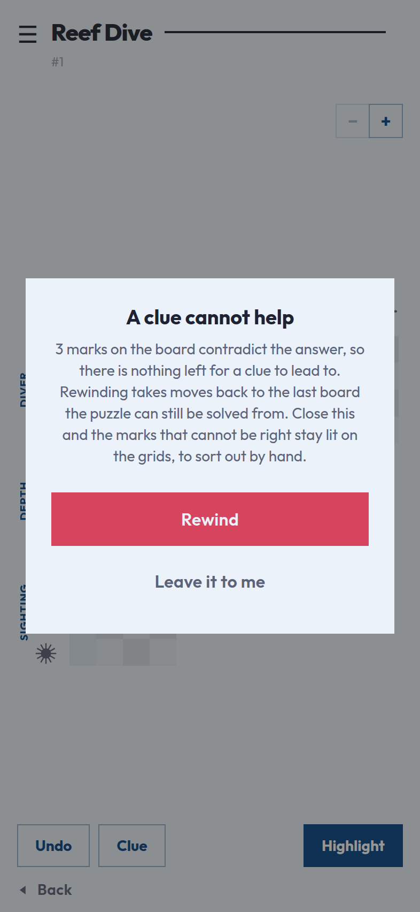<br>**10. Out of reach** — asking for a new clue checks the board first, and stops with a window offering to rewind when the answer has been marked away. | 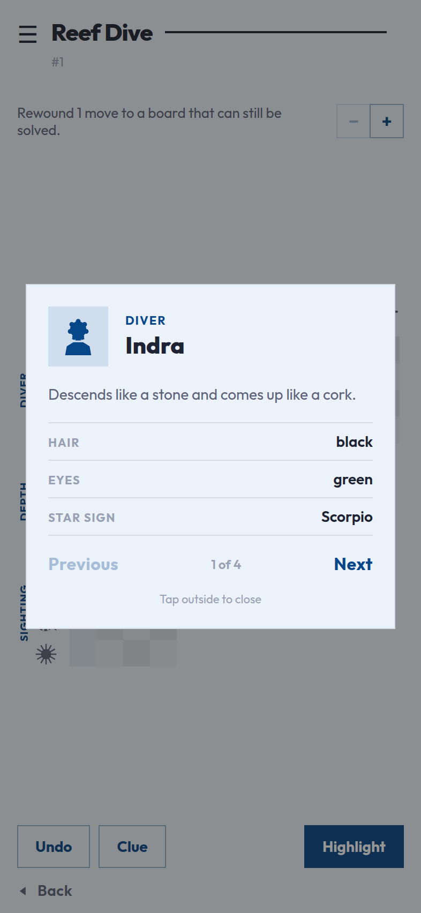<br>**11. Item card** — tap any picture on the board to meet it, and page through the rest of its set. | 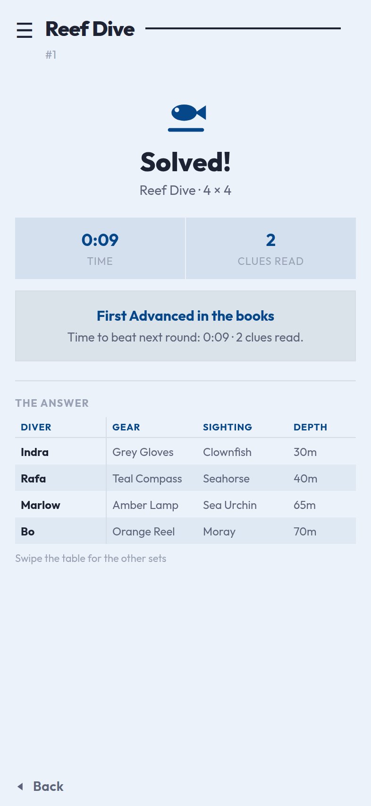<br>**12. Solved** — the finish takes the screen: time, clues read, how it compares, the answer table. |
| 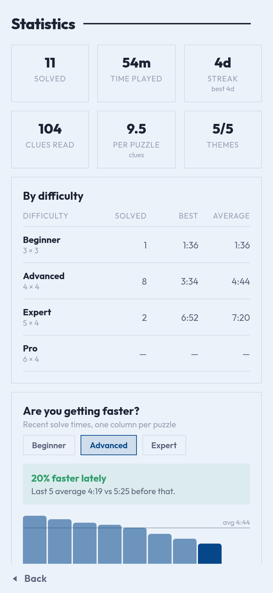<br>**13. Statistics** — totals, bests by difficulty and the trend of recent solve times. | 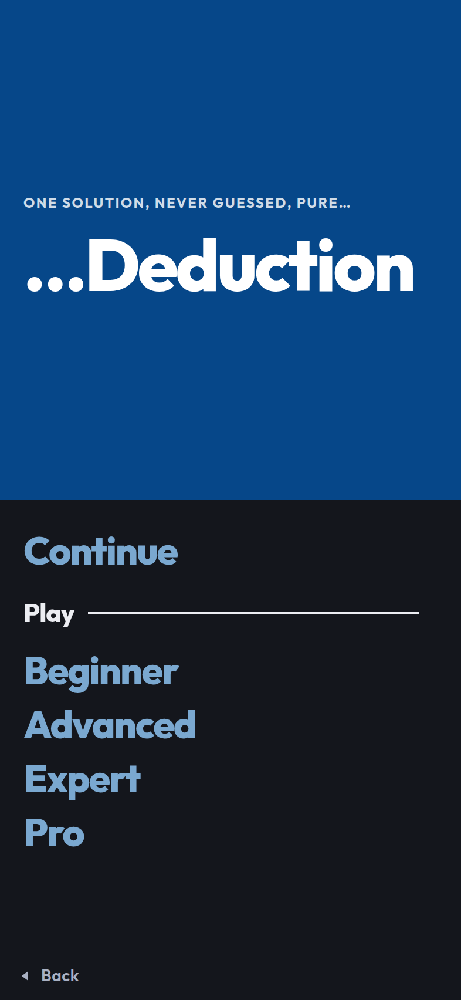<br>**14. Night** — the difficulties in night colours, with a game waiting behind **Continue**. | |

The theme differs from run to run because it is drawn at random, and the
statistics screen is captured with a sample history baked into the script — the
rest is the app behaving normally.

## How you play

1. **Start** — the screen is halved. The top half is a panel of the link
   colour carrying two lines in white, sitting in the middle of it with nothing
   to press: "One solution, never guessed, pure…" and then, in the largest type
   the app has, **…Deduction** — the name picking the sentence back up where the
   line above dropped it. Nothing is written under it; the bottom half is the
   page's own colour and holds the two ways in, **Daily** above **Play** with a
   rule between them. Everything hangs off the same left margin so the eye drops
   down one edge. **Settings** and **Statistics** are text at the foot of the
   screen — Statistics pushed to the right so the two sit in opposite corners
   rather than reading as a pair.
2. **Play** opens the difficulties, which is the same page with its bottom half
   swapped — the panel above is the same block, given the same half, as it is on
   every screen before a board: Play → a difficulty → a number changes the
   bottom half three times and never the top. It is
   where a game you left in progress waits: **Continue**, one word above
   everything else, which picks it up with the clock where it stopped. Under it
   a **Play** heading — with a rule drawn out of the word to the right of it —
   and **Beginner** (3 × 3), **Advanced** (4 × 4), **Expert** (5 × 4) and
   **Pro** (6 × 4), set as a list of words as large as the half they stand in
   allows: the whole list is on the screen at once, since a word that has to be
   scrolled to might as well not be there. The shapes are not printed beside the
   names — they are on the board a minute later, and were never the thing being
   chosen — but a screen reader still hears them. The shape is what makes the
   difficulty: the first number is how many items each set holds, the second how
   many sets take part, so a Pro puzzle is six items across four sets and six
   grids to fill.
3. **A difficulty opens its games, numbered from one.** A puzzle is decided
   entirely by its seed and its shape, and the generator is deterministic, so
   the number *is* the puzzle: game 7 at Expert holds the same cast, the same
   answer and the same clues on anybody's phone, this year or next. Pick one and
   it starts — that number becomes the seed. The list is paged rather than
   scrolled, six to a page — which is what the half of the screen under the
   panel holds — with **Previous** and **Next** under it. Every row is
   **Puzzle 7** with a box on its left, empty until you finish it and then
   ticked, drawn the way the settings screen draws a checkbox because that is
   what it is: a column of them says how far through a difficulty you are
   without reading a word. A finished one carries its time on the right as well,
   which is the thing to beat. Starting any
   game replaces the one saved in progress, which is the only way to throw one
   away, since choosing what to play instead is the same decision.
4. **Daily** is the other way in, under the same panel: today's four
   challenges, one per difficulty, seeded by the date so everybody gets the same
   four on the same day. Each is
   played once — finish one and its row shows the time instead, and pressing it
   opens the result rather than a board. Tomorrow the date moves the seed on and
   all four are open again. The theme, as everywhere, is drawn by the seed: one
   of five settings, its sets and its cast sampled from pools of fourteen items
   each, so two puzzles rarely share a line-up.
5. **Game** — the board names the puzzle's theme in the same ruled title every
   other screen uses, with the burger beside it and the seed underneath, and
   nothing else: no clock, because one counting up is a thing to watch rather
   than a thing to use. The time is still kept, saved with the game and read
   out at the finish. The whole puzzle is drawn as one staircase of grids, the way a
   printed logic puzzle is laid out: every pair of sets meets in its own grid,
   so a four-set puzzle is a 3 × 3 arrangement holding six grids, and each grid
   is items × items. Each item is headed by its own silhouette rather than its
   name, on both axes: a name long enough to read has to be turned on its side
   above a column, and a picture is the same shape whichever edge of the board
   it sits on. Tap one to open the card that says, in words, which is which.
   Nothing on the screen scrolls: the board opens at the size
   that fits the space it is given, with the clue in play beneath it. The board
   takes no marks until you have read a clue — with nothing said about the
   puzzle, a mark could only be a guess. After that, tap a square to cycle it
   blank → ✕ → ✓. A tick crosses out the rest of its row and
   column for you, and cycling that tick back to blank takes those crosses away
   with it — anything you crossed by hand stays put. **Automatic crosses** and
   **Auto add facts** — which fills in a tick that follows from two others, so a
   pairing carried across a shared entity lands on the board without you copying
   it over — can both be turned off, from the menu or from Settings. The set
   names and item pictures stay pinned while the grids scroll sideways, and − / +
   resize the squares past the fit.
6. **Clues arrive one at a time.** They do not always use names: about a third
   of the time a clue describes something instead — "the diver with green eyes",
   "no payload made of glass" — and a description that covers two things says
   something about both at once. The cards behind the labels are where those
   descriptions are written down, which is what makes tapping them worth doing;
   **Previous** and **Next** on the card walk the rest of the set, since a
   description is a question about all of them rather than about the one whose
   picture was tapped.
   **Clue** opens a window with one clue in it, under a line saying who is
   supposed to have said it — "One diver remembered that…", "Word went round
   that…" — drawn from the seed and the clue's own number, so it is the same
   line every time that clue is read. The ones that name somebody use the
   theme's own word for one of its cast. It says who, never what, so it cannot
   help or mislead: a clue is a bare fact, and a bare fact is nobody's.
   **Previous** and **Next** sit under it, with which clue you are on between
   them.
   Previous walks back through the clues you have already read, which is free.
   Next walks forward through them and, at the end of them, asks for a new one:
   the same press, and the same cost, so reading a clue stays the one decision
   the game counts and cannot be got round by walking forwards. The window is
   there because a clue needs the room — the longest ones name two things by
   description apiece and ran off the end of the panel this used to be. **Undo**
   sits beside Clue at the bottom left, and **Highlight** at the bottom right
   lights up every row and column the clue in play talks about; it fills with
   the colour while it is on, so the board does not have to be read to find out.
   A clue reads the same whether or not the board has caught up
   with it: the game tracks which clues are spent, since that is how the button
   knows which to hand over next, but it does not say — whether a clue still has
   something to give is the thing worth working out, and a panel that struck
   itself through would be marking your work. A clue
   you pass over is not gone — the button wraps round to it on a later lap, by
   which time the board may have enough on it for the clue to bite. **The clues
   never run out**, and nothing announces it: a puzzle carries only the handful
   needed to crack it, so when they are all spent the game writes you a new one,
   and another after that, each arriving like any other clue. How
   many you read is the score the statistics keep — there is no total to read it
   against, so working a clue harder before asking for the next is the whole
   game.
7. **Undo** takes back one mark at a time, autos and all. **Clue**
   looks at the board before it hands anything over: a puzzle has one answer, so
   a single mark that contradicts it puts the answer out of reach, and a clue
   read against a board you can no longer solve is a clue wasted. When that has
   happened it stops the game with a window saying how many marks contradict the
   answer, offering **Rewind**, which takes moves back until the board can be
   solved again — or **Leave it to me**, which closes the window on a board with
   the squares that cannot be right lit up, to sort out by hand. The
   clock starts when you ask for the first clue — with nothing to go on there
   is nothing to solve, so the time spent reading the sets is not part of it —
   and stops when the last square is right. Finishing replaces the board with
   the result: the clock, how many clues it took, how the game compares with
   your earlier ones, and **the answer as a table** — one row per person, one
   column per set, so the whole solution reads across in a line. The first set
   stays pinned while the others scroll sideways, which keeps every heading on
   one line. The grid does not come back: a solved board takes no more marks,
   and the answer above it says everything the squares would. There is nothing
   to press: `◀ Back` leads to the setup screen, which is where the next puzzle
   is chosen.
8. **Puzzle settings**, behind the burger at the top left, holds everything that acts
   on the game rather than on a square: the two board settings and the colour,
   boxed and named exactly as the settings screen has them (they are the
   player's, not the puzzle's, which is why they are worth reaching mid-game),
   then **Restart puzzle** (same puzzle, fresh board and clock), which throws
   away a filled-in board and so asks first. There is no way to be shown the
   answer: a puzzle that can be given up on is a puzzle nobody has to finish,
   and finishing it is the whole of the game. It is left the same way as
   every other screen — `◀ Back`, bottom left — which returns to the board.
   The board's own `◀ Back` goes back one step further, to the setup screen
   the puzzle was chosen on, so the next one is a tap away; the board is saved
   on the way out either way, and it is the first thing on that screen if you
   want it back.
9. **Settings** — a list of names with a box, a slider or a value against
   each: the board pair above; **match the device**, which follows the phone's
   own light and dark setting and turns with it, and **night colours** for a
   warm near-black page when it does not; **colour**, which cycles through the
   five the app draws in and is reachable from the game's menu too; **volume**,
   in four steps from off; and **vibration**. Nothing explains what any of them
   does, because all of them show their effect the moment they are touched.
   They are written to disk, so they are the same the next time the app opens.
10. **Come back later** — the board saves itself as you play, so closing the app
   mid-puzzle costs nothing. It is waiting behind **Continue** on the difficulty
   screen when you come back, with the clock where you left it and the same
   puzzle in front of you.
11. **Statistics** — solved count, time played, day streak, clues read (in total
   and per puzzle), a table of best and average times by difficulty, a chart of
   recent solve times, and the list of recent games. Finishing a puzzle shows
   how that time compares with your earlier games at the same size.

## Getting around

One rule, everywhere: **the way back is `◀ Back`, at the bottom left.** Every
screen but the start page has it, in the same words and the same place, and it
goes back exactly one step.

The top left is left to one thing: the **burger** on the board, which opens the
game's menu. That is the only control in that corner anywhere in the app, so a
tap there always means the same thing. A corner that goes back on one screen and
opens something on another is a corner nobody trusts, which is why no screen
carries a header button at all — a screen's name is `RuledTitle`, which is text
— and the menu is dismissed with `◀ Back` rather than a cross where the burger
was.

`src/ui/BackLink.tsx` is the link itself — one component, so the wording, the
tap feedback and the position cannot drift apart between screens. Its triangle
is one of the app's own silhouettes rather than a typed glyph, so it is solid
and the same shape everywhere. It also carries the bottom safe area, which makes
it the last thing on a screen: the scrolling part above it never has to leave
room for the home indicator.

The start page is the one screen with nothing behind it, so it has no back link.
Its bottom row is **Settings** and **Statistics** instead — plain text, left and
right, in the place the eye has already learned to look.

## Project layout

```
App.tsx                     screen switching + puzzle generation entry point
scripts/screenshots.mjs     drives the app in a browser to refresh docs/screenshots
scripts/sounds.mjs          synthesises the three effects in assets/sounds
scripts/icons.mjs           draws the silhouettes and collects them into path data
scripts/icons/              the drawing kit, and one module per theme
src/data/themes.ts          the five themes: categories, item pools with their
                            traits and descriptions, clue wording
src/data/sizes.ts           the four sizes, and the difficulty each is called
src/data/openers.ts         who is supposed to have said a clue
src/puzzle/types.ts         puzzle, clue and theme model
src/puzzle/rng.ts           seeded PRNG (a seed always rebuilds the same puzzle)
src/puzzle/generator.ts     builds a solution, then a minimal clue set for it
src/puzzle/solver.ts        constraint solver: propagation + search
src/puzzle/describe.ts      clue objects → sentences, using each theme's wording
src/game/board.ts           the player's ticks and crosses, mistakes, win check
src/game/library.ts         the numbered catalogue and the daily seed
src/game/clues.ts           what a clue asks of the board, which are spent, and
                            how a new one is written when they run out
src/game/layout.ts          the staircase arrangement + the answer table
src/game/persistence.ts     what gets written to disk, and the guards to read it
src/game/usePersistence.ts  saved game + finished games as React state
src/game/time.ts            duration formatting
src/game/useTimer.ts        elapsed-time hook
src/stats/summary.ts        history → stats per difficulty, streaks, improvement notes
src/storage/store.ts        the only module that touches AsyncStorage
src/components/             GridBoard, SolutionTable, CluePopup, ItemCard, …
src/screens/                StartScreen, SetupScreen, NumbersScreen,
                            DailyScreen, ResultScreen, SettingsScreen,
                            GameScreen, GameMenuScreen, StatsScreen
src/game/settings.ts        the player's settings, and reading them back
src/game/useSettings.ts     those settings as React state, written as they change
src/ui/                     Text, ThemeProvider (day/night), palettes,
                            spacing, borders, sound and haptics
src/ui/accents.ts           the five colours the app can be drawn in
src/ui/BackLink.tsx         the bottom-left `◀ Back` link, the one way back
src/ui/RuledTitle.tsx       a screen's name with a rule drawn out of the word
src/ui/SettingRow.tsx       the boxes, sliders and word-actions the two settings
                            screens are made of
src/ui/TitlePanel.tsx       the app's name on a block of the link colour, the
                            top half of every screen before a board
src/ui/Pager.tsx            Previous and Next, shared by the three lists
src/ui/Icon.tsx             one silhouette, drawn in whatever colour it sits in
src/ui/icons.generated.ts   the silhouettes as path data (generated, committed)
assets/icons/               one SVG per item, theme and interface icon
assets/sounds/              the three effects, committed as 16-bit mono WAVs
```

## How the board is laid out

`src/game/layout.ts` turns a set count into the classic arrangement. Sets 1…N-1
run across the top as columns; sets 0, N-1, N-2 … 2 run down the side as rows.
A block is drawn where a row set meets a column set for the first time, which
leaves the familiar staircase:

```
              Destination   Ship     Launch
   Astronaut     ■■■■       ■■■■      ■■■■
   Launch        ■■■■       ■■■■
   Ship          ■■■■
```

Four sets therefore give a 3 × 3 arrangement of six grids, three sets a 2 × 2
arrangement of three, and five sets a 4 × 4 arrangement of ten — every pair of
sets exactly once, which is what makes cross-referencing possible: a tick in
Astronaut × Ship can be carried into Ship × Launch without leaving the board.

## Colours

There are two palettes, `dayPalette` and `nightPalette` in `src/ui/theme.ts`,
and a screen never names a colour — only a role. `ThemeProvider` resolves the
player's preference (day, night, or match the device) against what the device is
actually doing and hands the result down; `useTheme()` reads it. "Match the
device" needs `userInterfaceStyle: "automatic"` in `app.json` to mean anything:
pinned to `light`, iOS tells every app the device is in day colours whatever the
player has set.

`StyleSheet.create` bakes its colours in at the moment it runs, so a stylesheet
written at module scope can never change scheme. Every component writes its
stylesheet as a function of the palette instead — `const makeStyles = (palette)
=> StyleSheet.create({...})` — and calls it through `useStyles`, which builds it
once per palette rather than once per app. Switching schemes is then a context
change, and everything below redraws.

The night palette is not the day one inverted: the ground is a warm near-black
rather than a pure one, the ink is a soft off-white so it does not glare, and
the board's two squares sit a little *lighter* than the page — the same
"printed on the paper" relationship read the other way up, because on a dark
ground it is the ink that has to lift off the page.

The **accent** is the one colour in the palette the player picks. A puzzle used
to carry its own, which meant the app changed colour every time the generator
rolled a different theme — a decision nobody made, taken away from the only
person with an opinion about it. `src/ui/accents.ts` holds the five it can be
instead, and the **Colour** row on the settings screen and on the game's own
menu cycles through them; a theme now decides only what a puzzle is *about*.

Each accent has two cuts. The `day` one is dark enough to carry white text; the
`night` one is lightened so it can be read on a near-black page, which leaves it
too pale for white. `resolvePalette` puts the right one in `accent` and always
puts the day one in `accentGround`, which is what the title panel is painted in
— so the panel is the same colour after dark and the white on it still reads.

### The colours

The two schemes, as they stand:

| Role | Day | Night | Where it lands |
|------|-----|-------|----------------|
| `accent` | set by the player | set by the player | links, ticks, headings, a chosen difficulty |
| `accentSoft` | set by the player | set by the player | a tick the board worked out, a live clue's border |
| `accentGround` | the colour's day primary | the colour's day primary | the title panel, in both schemes |
| `bg` | `#F6F3EC`, or the colour's own | `#14161C` | the page |
| `surface` | `#FFFFFF`, or the colour's own page | `#1B1E26` | cards |
| `surfaceAlt` | `#FBF9F3`, or a shade into that page | `#20242D` | a card with nothing on it yet |
| `boardLight` | `#F1EEE4` | `#232733` | the board's lighter square |
| `boardShade` | `#E7E1D4` | `#2C313F` | the board's darker square |
| `ink` | `#1D2333` | `#ECEDF2` | everything you read |
| `inkSoft` | `#5C6379` | `#A9B0C2` | a second line |
| `inkFaint` | `#98A0B3` | `#6C748A` | labels, and what a row says underneath |
| `line` | `#E7E1D4` | `#2C313F` | borders |
| `lineStrong` | `#D2CAB6` | `#3C4354` | the board's outer edge |
| `danger` | `#D6455D` | `#FF7A8E` | discarding, clearing, a wrong mark |
| `success` | `#2E9E6B` | `#5FCF9B` | a personal best, a faster run |
| `chart.series` | `#2A78D6`, or the colour itself | `#6E9BE8` | the bars on the trend |
| `chart.grid` | `#EBE6DA`, or a shade of that page | `#2C313F` | its gridlines |
| `chart.reference` | `#B7AF9C`, or a deeper one | `#4A5265` | its average line |

And the five the player can pick between. Each is a small set rather than a
single hue — a **primary** for links, ticks and headings, a **secondary** for
the quieter half of the same job, and optionally the **page** they are meant to
sit on — with a set per scheme:

| Colour | Day primary | Day secondary | Day page | Night primary | Night secondary |
|--------|-------------|---------------|----------|---------------|-----------------|
| Blue | `#064789` | `#427AA1` | `#EBF2FA` | `#7AA8D0` | `#4E88B5` |
| Violet | `#7A64FF` | `#8B8BE8` | `#F8F7FF` | `#8B8BE8` | `#7A64FF` |
| Teal | `#0F7C7B` | `#77B2AE` | — | `#4FC7C4` | `#357E7C` |
| Green | `#2F8F4E` | `#89BC95` | — | `#6ACF72` | `#45834B` |
| Rust | `#B25F2E` | `#D1A284` | — | `#E39A63` | `#8E6342` |

A colour with a page of its own brings the shades that sit on it too —
`surface`, `surfaceAlt`, `boardLight`, `boardShade`, `line` and `lineStrong` are
worked out from that page by `pageShades`, because leaving the warm cream board
squares on a cool blue page reads as a mistake rather than as a choice. A colour
with no page leaves the scheme's own alone, and its hand-picked shades stay
exactly as they are.

On such a page a card **is** the page rather than a white sheet laid on it: a
white card on a tinted page is the brightest thing on the screen, which is a lot
of emphasis for something that only means "these belong together" — its border
and its shadow already say that. The quieter surface goes the other way, a shade
*into* the page rather than out of it.

The chart goes with them: its gridline and its average line are page shades
doing a chart's job, and its bars take the colour the app is drawn in. A chart
in a different blue from everything around it, on a blue page, reads as an
accident rather than as a second meaning.

Violet's two colours serve both schemes, swapping which of them leads: on a pale
page the deeper one leads and the lighter is the quiet half, and on a near-black
one it is the other way round.

The secondary is where the board draws a tick it worked out for itself, and the
border on a clue still in play. Both were arbitrary tints of the accent before —
a chosen colour is a better answer than 55% of another one.

Anything painted in the accent asks which ink to put on it rather than assuming
white: `inkOn` picks whichever of white and the page's own ink reads better on
that ground, so the title panel and a solid button work with a deep navy and
with a pale lilac alike, and the status bar follows the panel it sits on. A test
holds every primary to at least 3:1 against whichever ink it gets.

Green's night primary is a leaf green rather than the mint `success` uses at
night: two greens a shade apart, one meaning "a personal best" and one meaning
nothing at all, is a distinction nobody can be asked to make. A test keeps every
primary off both `success` and `danger` in both schemes.

## Typography

The typeface is **Outfit**, a geometric sans loaded from
`@expo-google-fonts/outfit`. A custom family has one file per weight and
`fontWeight` cannot pick between them — asking for 700 of a family with no bold
face gets a synthetic one, which smears the letterforms — so `src/ui/Text.tsx`
is a drop-in `Text` that reads the weight out of the style, swaps in the face
that carries it, and drops the weight so nothing is emboldened twice. Every
screen imports `Text` from there rather than from React Native, and `App.tsx`
waits on `useFonts` before drawing so the app never reflows from a system font
to this one. Swapping typeface means changing the package, the five names in
`App.tsx`, and the map in `Text.tsx`.

Nothing in the app is rounded: the `radius` scale in `src/ui/theme.ts` is zero
throughout. Where bordered neighbours do sit flush they carry `joinLeft` /
`joinTop`, a one-pixel negative margin that makes the two share a single edge
rather than each drawing its own. Grid blocks, menu rows and
the toolbar buttons sit flush, so a group of them reads as one ruled table the
way a printed puzzle page does. That is for parts of one thing, though, not for
things that are separately readable: the statistics screen keeps its spacing —
between its cards and between its stat tiles — and so do the two rows that mark
a chosen item, the difficulties on the setup screen and the filter on the
statistics screen, where a shared edge would paint over the selection's own
border.

There are no lines on the board at all. Inside a block the squares alternate
white and a shade, like a checkerboard, and that shading is what keeps a row
readable across the grid; around each block is a two-pixel band painted in the
page colour, so what separates one grid from the next is a gutter of background
rather than a rule. Both squares sit a little deeper than the page —
`boardLight` at L\* 94.1 and `boardShade` at 89.7 against the page's 95.9 — so
the grid reads as printing on the paper rather than paper laid on it. Near-white
squares on a deeper page were tried and shimmered; tinting the squares instead
is calm at every size. A block's box carries that band on each side and is measured
to suit — `blockBox = cellSize * items +
2 * BLOCK_BORDER` — so the squares inside come out at exactly `cellSize` and
line up with the labels beside them, and `fitCellSize` allows for the rules when
it sizes the board.

The game screen is one fixed-height layout: the zoom pair and whatever the app
has to say on a line above, the staircase, and the toolbar pinned below.
Nothing about it scrolls. `fitCellSize` measures the space actually left for the
board — width *and* height, from an `onLayout` on the board area rather than
from the window — and picks the largest cell whose whole staircase fits it. The
zoom buttons go up from there, and only a board zoomed past its fit scrolls, in
whichever direction it outgrew. The clue lives in a window rather than on the
screen, so nothing a clue says can resize the board under the player's finger —
and the board keeps the room a clue panel used to take.

`isSolvable` is `findMistakes` read the other way round: a puzzle has exactly
one answer, so a mark the answer contradicts is a mark nothing later can put
right. That is what **Clue** tests before handing one
over and what Rewind pops the undo stack towards; `clearMistakes` is the fallback for a board whose history has run
out — a resumed game starts with an empty stack, so its undo history begins
where the player picked it up. The stack itself is session-only and holds the
last 200 boards.

Winning adds a tab rather than covering the board. There is no tab bar during
play — there is only the board to show — so the bar appears at the finish with
**Grid** and **Solved** in it, `SolvedPanel` fills the body, and the win selects
it. Everything the finish made pointless goes with it — the row of buttons is
hidden — and the board becomes read-only, because a stray tap on a finished grid would undo
the win, restart the clock and have the game counted a second time.

The result offers nothing to press either. Another puzzle, a different
difficulty and the statistics are all where they always are, behind `◀ Back`,
so the panel is something to read rather than a junction to get past — and the
app has one way out of a game rather than four.

## Clues, one at a time

There is no clue list. **Clue** opens a window holding one clue, and **Next**
past the end of the ones already read asks for another, which makes reading a
clue a decision — and the number of them the statistics keep. Going back through
what you have been told is free; going on is not.

Above each one, `src/data/openers.ts` says who is supposed to have said it. The
list is fourteen lines, four of which use `{noun}` — the theme's own word for
one member of its anchor set, which every theme already carries for its clue
wording, so a reef puzzle says "One diver remembered that…" and a café one says
"One customer remembered that…". Which line a clue gets is drawn from the
puzzle's seed and the clue's own index rather than rolled when the window opens:
paging back to a clue brings back the clue you read, and a game picked up
tomorrow is the game you left. Nothing is stored — the seed is enough to say it
again. An opener says who and never what, so it cannot help or mislead.

`src/game/clues.ts` decides when a clue is spent. `clueMarks` returns the
squares one clue forces *given the board as it stands*, which is the same thing
a player does when they re-read a clue after learning something: a plain link
wants its tick or its cross; an either-or wants a cross on every option it
leaves out, and names the survivor once the other is ruled out; a comparison
separates the two entities it names and rules out the values at either end of
the scale that nothing left on the other side could sit beyond. Because the
board is read on the way in, the answer is a fixpoint — once every mark it lists
is down, running it again lists the same ones and no more — so `clueDone` is
simply "are they all there", and `cluesDone` is the set of clues the board has
caught up with.

Only what the clue itself says is counted. The crosses that follow from a tick,
and the tick that follows from the last blank in a row, are the grid's rules
rather than the clue's, and the board fills those in on its own. Who marked a
square makes no difference either: a cross the board added counts as much as one
the player made, which is what lets a single tick finish several clues at once.

`nextClue` walks on from the clue on the table and wraps round, skipping the
ones that are done, so a clue passed over early comes back on a later lap once
the board has enough on it for it to bite. Which clues are spent is the
button's business and nobody else's: the card draws a clue the same either way,
so working out whether one still has something to give is left to the player.

**The clues never run out.** A puzzle ships with the smallest set that cracks
it, so a player who has spent them all and is still short of the answer would
otherwise have nowhere to go. When there is nothing left to hand over — every
clue used up, or the only one still worth reading is the one already on the
table — `inventClue` writes another. The generator's pool of true statements
about the solution is rebuilt from the puzzle and searched for one the board
cannot already say and that has not been asked before, least revealing first: a
cross to rule something out, then the clues that need a second thought, and a
plain "X is Y" only when nothing else is left, because that one hands over an
answer rather than pointing at it. Written clues are appended to the puzzle's
own list, which is what gets saved, so a resumed game keeps the ones it was
given. `null` comes back only when everything true about the puzzle is already
on the board, which on a board with no mistakes means it is finished; the button
answers that with a buzz and nothing else, since a board with everything on it
is a board the player can see.

None of this is announced. A clue written on the spot arrives exactly as the
puzzle's own do — no line saying the clues ran out, no line saying a fresh one
was written — because where a clue came from is bookkeeping, and being told the
game is improvising is being told the puzzle is over.

That is why nothing is counted out of a total: the number of clues a game takes
is not fixed by the puzzle, so what the app shows and the statistics keep is
simply how many were read.

Property tests pin the ends down: on an empty board no clue counts as done, and
on a solved board every one of them does; a written clue is always true (the
finished board agrees with it) and always says something the board does not; and
a board that only ever marks what it is told, asking for another clue whenever
it runs out, reaches the answer.

In `src/game/board.ts` every square records who marked it. A tap by the player
is a `hand` mark; a cross the board adds because a tick rules out the rest of
its row and column is an `auto` mark that remembers the tick it came `from`.
`reconcile` rebuilds the automatic crosses around the hand marks after every
change, and only ever fills a square the player has left alone.

That distinction is the whole point: cycling a tick back to blank drops the
crosses it added, but a cross the player placed by hand stays put — even one the
tick would also have implied, since the tick never claimed that square in the
first place. It is also what lets either board setting be switched off and on
again without touching anything the player did.

`reconcile` works in the order the reasoning goes. **Auto add facts** comes
first: a tick says two attributes belong to one entity, so the ticks read as
edges and every connected group is one entity, whose members are all paired with
each other — that is how `A1 × B3` and `B3 × C2` put a tick on `A1 × C2`, and it
carries chains of any length, in any direction, not just the three-step case.
Then **Automatic crosses** rules out the rest of the row and column of every
tick, worked out ones included. Two attributes from the same set can only land
in one group on a board that has already gone wrong, and those pairs are left
alone rather than marked with a pairing that cannot exist.

`solutionRows` in the same module produces the end-of-game summary: one row per
entity and one column per set, ordered by the ordered set (earliest year,
cheapest bill…) so it reads like the answer key of a printed puzzle. The table
pins its first column and scrolls the rest, so set names never have to wrap.

## Sound and feel

Three effects and three haptics, behind one module. `src/ui/feedback.ts`
exposes `feedback.tap`, `.mark`, `.success` and `.warn`; a call site says what
happened — a navigation item was pressed, a square was marked, a puzzle was
finished, a board went wrong — and never which file to play or which motor to
run. `tap` is a selection buzz and a soft click, `mark` a light impact and a
shorter, brighter one, `success` a success notification and a rising arpeggio,
and `warn` is haptic only, because the app has nothing pleasant to say and
saying it twice would be worse.

Both are niceties, so every path swallows its own failure: a device with no
haptic motor, a simulator with no speaker, or a player that will not load costs
the effect and nothing else. The players are built on the first sound asked for,
not at import, and the audio mode marks these as effects rather than media —
they mix with whatever the player is listening to instead of interrupting it,
and they respect the silent switch, because a puzzle game chirping through a
muted phone is a bug.

The settings live in a module-level value rather than a context. These fire from
event handlers on nearly every screen, and threading a provider through all of
them would buy nothing; `App` keeps that value in step with the stored settings
from an effect. **Volume** is a four-step slider (off, quiet, medium, loud) and
**Vibration** is a box — off means silent, and off on both means a game that
makes no noise at all. Turning the volume down plays the tap at the volume being
left behind, since that is the one the player just heard.

The sounds are synthesised rather than sampled: `npm run sounds` writes
`assets/sounds/{tap,mark,success}.wav` from `scripts/sounds.mjs` — three short
tones from one scale (E5, A5, and the A major triad), shaped by the same
envelope, so they sit together as one voice and the repository carries no audio
it did not make. The WAVs are committed, so a normal build never runs it.
Swapping one for a real recording means dropping a 16-bit mono WAV of the same
name into that folder; nothing reads those numbers at runtime.

## The icons

Everything the app draws — every item, every theme, the lamp on the clue button
and the chart on an empty statistics screen — is a **silhouette**: one closed
shape, filled in one colour, in a 100 × 100 box. There is no artwork with a
palette of its own, so an icon takes the colour of whatever it sits in and looks
right in day mode, night mode and against the accent without being drawn
three times. 357 of them, one per entry, and a test fails if two share a path.

They come from three places, in a line:

```
scripts/icons/*.mjs   →   assets/icons/**.svg   →   src/ui/icons.generated.ts
   drawn in code            the artwork itself         what the app ships
```

`npm run icons` walks that line. `scripts/icons/draw.mjs` is a small drawing kit
— `circle`, `poly`, `wedge`, `star`, `band`, `blob`, `hole` — and one module per
theme says what each item looks like in terms of it. Anything that is a scale
(a launch year, a bill, a depth, a plant's height) is drawn by
`scripts/icons/scales.mjs` as a motif that **grows with the number**, so the
fourteen rungs of one ladder read as a ladder. People are `people.mjs`: one body
per theme and seventeen ways of wearing hair, each of which changes the *outline*
of the head, because a silhouette has no face to tell anyone apart by.

**The SVG files are the artwork, not a cache.** The script writes a file only if
it is not already there, and then re-reads every file on disk to build the path
data — so hand-editing an SVG, or replacing one wholesale with a drawing from
somewhere else, is the supported way to change an icon, and the next run keeps
it. Redrawing one from code means deleting its file first. `node scripts/icons.mjs
--sheet` also writes `docs/icons.html`, a contact sheet of the lot, which is the
quickest way to see whether a change made something worse.

`src/ui/icons.generated.ts` is generated and committed: the app imports path
data, never SVG files, so nothing is read from disk or parsed at runtime and an
icon costs one `<Path>`. Prettier leaves that file alone — it would reflow the
path data and the next run would put it back.

Names are derived, not written down: `iconName(theme, category, label)` in
`src/data/themes.ts` slugs the label into `cosmic/astronaut-juno`, so an item and
its drawing cannot drift apart without a test noticing. An unknown name renders
nothing rather than a broken box, which is what keeps a game saved before an item
was renamed from crashing on open.

## Items, traits and descriptions

Every item in every category carries four things: its label, an icon, a line
about it for the player who taps it, and a value for each of its category's
**traits** — hair, eyes and star sign for people; what a thing is made of, how
big it is, what it is for. There are at most four per category, and a test holds
every item to all of them, so nothing turns up on a card with a blank in it.

Traits exist so a clue can point at something without naming it. Each is written
as a phrase with the noun in it — `{noun} with {} hair`, `{} {noun}`, `{noun}
made of {}` — which reads as "astronaut with red hair" or "payload made of
glass" with no article on the front, because what goes in front depends on what
the clue is doing with it.

A clue is about the *entity*, though, not the item: "the Bone Sling wielder" is a
hero. So every category carries a second frame beside its `pattern` —
`describes` — for an item that is being described rather than named: "the {}
wielder" has "the wielder of the {}" beside it. The articles are written into
the frame, and the wordings that need something other than "the" rewrite them:
the first becomes **no** and the rest **a** for a group being ruled out ("no
wielder of a weapon made of silver"), and all of them become **a** for one of
several ("an owner of a small pet").

Which brings the two ways a description gets used:

- **In place of a name**, when it fits exactly one item in the cast. `describe.ts`
  works out those descriptions per item, and a hash of the seed and the slot
  decides — the same way every time a clue is read — whether to use one and which.
  Roughly one slot in three, so the cards are worth reading and the clues are
  still mostly plain.
- **For a group**, in the `groupNot` clue: "no payload made of glass shares a
  mission with the Kestrel" is one sentence that puts a cross against every
  glass payload. The clue carries the item indices it resolved to alongside the
  trait and value, so the solver and the board never look them up again, and it
  is worth as much to a puzzle as several plain crosses — which is why a few are
  offered up front, where they survive minimising. It counts as a link clue for
  the three-in-four floor, because that is what it is: a cross, said once about
  several rows.

The either-or clue gets the same treatment for free: when its two options are
exactly the cast's holders of one trait value, it is written as "paired with a
payload made of glass" rather than naming both. Same statement, less to read.

Only the traits the sampled cast actually varies by survive into a puzzle: one
every item answers the same way describes nothing, so `sampleCategory` drops it
before the generator ever sees it.

## How the puzzle engine works

A puzzle has `size` **entities** and a handful of **categories**. Each entity
owns exactly one item from every category and no item is shared, so a solution
is just one permutation per category. Category 0 (the people) is pinned to the
identity permutation, which stops the same arrangement being counted twice under
a relabelling of entities.

**Generating** (`generator.ts`):

1. Draw a theme from the pool, then its categories — always including one ordered
   category (a year, a price, a depth…) so comparison clues are possible — then
   sample the items each category contributes and roll a random solution. Every
   one of those draws comes from the seeded generator, so a seed rebuilds the
   whole puzzle, cast included.
2. Build a pool of clues that are all *true* of that solution:
   - `A is paired with B` / `A is not paired with B`
   - `No {description} is paired with B` — one statement about a described group
   - `A is paired with either B or C`
   - `The depth for A is deeper than for B`, optionally with an exact gap
3. Add clues one at a time until propagation alone cracks the grid.
4. Try removing every clue in turn, keeping the removal whenever the puzzle is
   still deducible. What is left is a minimal clue set.

Link clues — the plain *is* and *is not* statements the grid is drawn for, group
clues included — make up **at least three quarters** of every finished puzzle. That is not something
the offer order can promise on its own, because which clues survive is decided
by the deduction rather than by the pool: a single comparison can do the work of
five crosses and stay in. So the generator spaces the flavour clues out among
the links, drops a redundant comparison before a redundant link when it
minimises, and if the mix still comes out short it builds the puzzle again with
the flavour thinner — down to links alone, which always clears the bar. A few
direct matches lead the pool, since a puzzle carried by links alone otherwise
needs half as many clues again to reach the same certainty.

**Solving** (`solver.ts`) keeps a candidate bitmask per (category, entity) in a
flat `Int32Array` and alternates:

- *propagation* — an item belongs to one entity and an entity to one item, plus
  one rule per clue kind, run to a fixpoint;
- *search* — branch on the most constrained cell, used by `solve()` when
  counting solutions.

Step 3 of generation deliberately uses the propagation-only entry point
(`solveByDeduction`). If pure propagation reaches a full grid, the answer is
provably unique *and* a player can reach it the same way — no guessing, no
backtracking. It is also much cheaper than proving uniqueness by exhaustive
search, which keeps generation at a few hundred milliseconds even for the 6 × 4
expert grids. `solve()` still exists for the tests, which independently confirm
that each generated puzzle has exactly one solution.

### Clue wording

The sentences clues are written in belong to the themes, not to the code. Each
theme can supply templates for the six kinds of clue, filled from named slots:

| Slot | Meaning |
|---|---|
| `{a}` `{b}` `{c}` | the things a link, group or either-or clue names or describes |
| `{greater}` `{lesser}` | the two sides of a comparison |
| `{noun}` | what the ordered set is called, e.g. "launch year" |
| `{comparative}` | which way it runs, e.g. "later" |
| `{gap}` `{unit}` | the exact difference, e.g. "3" and "years" |

So Cosmic Voyage says

```ts
clues: {
  link: '{a} shares a mission with {b}.',
  groupNot: 'No {a} shares a mission with {b}.',
  compare: '{greater} launches {comparative} than {lesser}.',
  compareGap: '{greater} launches exactly {gap} {unit} {comparative} than {lesser}.',
  …
}
```

and reads "The Kestrel launches later than Milo", while Reef Dive says "The
Pipefish spotter went exactly 18 metres deeper than Nico" and Mythic Quest
"Wren is not the Minotaur slayer".

Anything a theme leaves out falls back to `DEFAULT_CLUE_TEMPLATES` in
`describe.ts` ("{a} is paired with {b}."), so a new theme can ship without
writing any of them. `resolveClueTemplates` merges the two at generation and
stores the result on the puzzle, which means a saved game keeps the wording it
was played with even if the theme is rewritten later. A test holds every
template to the slots its clue needs — dropping `{b}` from a link would quietly
halve the clue — and to a capital letter and a full stop.

The item `pattern` on each category (`the {} mission`) is what those slots are
filled with, so the two are written together: change the voice and the patterns
usually want a look as well.

### Seeds

Every new puzzle is given a freshly rolled 32-bit seed, and that seed decides
everything the player did not choose: which theme is drawn, which of its sets
play, which items are sampled from their pools, the solution, and the clues.
`generatePuzzle({ theme, size, seed })` with the same seed and size rebuilds an
identical puzzle — a test asserts exactly that, which is what makes the seed a
fair name for a puzzle rather than a debugging curiosity.

The seed is therefore never re-rolled for a puzzle already in play:

| Action | Seed |
|---|---|
| A numbered game | the number itself: game 7 is seed 7 |
| A daily challenge | the date read off the calendar: `20260829` |
| **Restart** | unchanged — same theme, sets, items, answer and clues; only the board and the clock start over |
| **Continue** | unchanged — the saved puzzle is stored whole and comes back as it was, clock included |

Nothing is rolled any more. Every puzzle in the app can be named and asked for
again, which is what makes a numbered list a catalogue rather than a wall of
strangers, and what lets two people compare a time on game 7. The seed is
printed under the title on the game screen.

The daily seed packs the three parts of the date into their own columns —
`year × 10000 + month × 100 + day` — so every date gets its own puzzle and the
numbers run in calendar order. Multiplying them together, which is the obvious
thing to reach for, does not: the 12th of February, the 8th of March and the 6th
of April all come to the year times 24, and would have handed out the same
puzzle three times a year. A test walks four years a day at a time and holds
every seed to being unseen.

`dailyDone` still checks the calendar day as well as the seed. The two kinds of
game share one seed space, so a numbered game 20,260,829 would otherwise answer
for the 29th of August.

## Persistence and statistics

Two things are stored, both under AsyncStorage, both versioned:

| Key | Holds |
|-----|-------|
| `logic-grid:saved-game:v1` | the puzzle in progress: the whole puzzle — including any clues written for this game — every tick and cross, which clues have been read and which is on the table, elapsed seconds |
| `logic-grid:history:v1` | the last 300 finished games: time, clues read, theme, size, whether it was revealed |

The keys keep the app's old name. Renaming them would leave every game already
saved on a device unreadable, and a prefix nobody sees is not worth a player's
half-finished puzzle.

The saved game stores the generated puzzle itself rather than its seed, so a
game in progress keeps playing exactly as it was even if the themes or the
generator change in a later version.

`src/storage/store.ts` is the only module that talks to AsyncStorage. Reads run
through the guards in `persistence.ts`, so data from an older version, a
half-written file, or a corrupt value reads as "nothing saved" instead of
crashing; writes are wrapped too, so a device that refuses to write costs the
player their save and nothing more. The board is written 600ms after each
change, when the app goes to the background, and when the player leaves the
screen; finishing a puzzle clears it.

`src/stats/summary.ts` derives everything shown from the list of finished games
— nothing aggregated is stored, so the numbers can never drift out of sync with
the games behind them. Nothing reveals a board any more, but a game recorded as
revealed before that is still read as one and kept out of the times: dropping
the handling would quietly fold those into a player's averages.
Games finished before clues were counted store `null` rather than a zero, and
are left out of the clue averages instead of flattering them: hints and clues
were different measures, so the old number is not read as the new one.
Improvement is measured two ways: `improvementFor` compares a game just
finished with earlier games at the same size (personal best, share faster than
average, rank), and `statsForSize` compares the last five solves with the five
before them for the longer-run trend the chart draws.

## Notes

- The five themes live entirely in `src/data/themes.ts`. Adding one is a matter
  of listing five categories, each with its `pattern` and `describes` frames, a
  `noun`, its traits, and a pool of items written as a table — label, a value
  per trait, and a line about it. Icons are not listed: each item's is named
  after it, and drawing the new ones is `npm run icons`. The ordered category is written as a
  `scale` instead: evenly spaced numbers, three bands, and a blurb per rung, with
  its traits falling out of the numbers themselves. A `clues` block gives the
  theme its own voice. The pools hold fourteen items apiece — well over the six a
  6 × 4 puzzle uses — which is what makes the draw feel fresh; tests keep every
  pool deep, distinct, short enough to fit the grid headings, and fully
  described.
- No backend and no analytics: everything is kept on the device, and clearing
  the statistics from the stats screen deletes it.
- `npm run sounds` rewrites the three WAVs in `assets/sounds` from
  `scripts/sounds.mjs`. They are committed, so this is only needed after
  changing how one of them is built.
- `npm run icons` redraws any missing SVG in `assets/icons` and rebuilds
  `src/ui/icons.generated.ts` from every file there. It never overwrites one
  that exists, so edit the SVG to change an icon and delete it to redraw it from
  code; `--sheet` also refreshes the contact sheet at `docs/icons.html`.
- `npm run screenshots` exports the app for web, serves that build, drives it in
  Chromium and rewrites `docs/screenshots`. Playwright's Chromium arrives with
  the dev dependencies (`npx playwright install chromium` if the download was
  skipped); `PLAYWRIGHT_CHROMIUM_PATH` points it at another binary, and
  `--skip-build` reuses the last export. **Treat the images as part of the
  build**: regenerate them alongside any change that alters a screen, so the
  README never shows a version of the app that no longer exists.
- `react-dom` / `react-native-web` are installed only so `npm run web` can give
  a quick preview away from a Mac; nothing in the app is web-specific.
