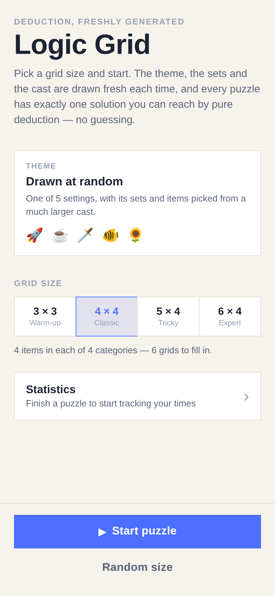
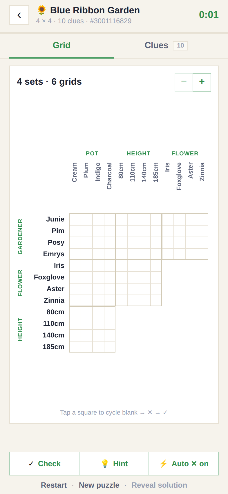
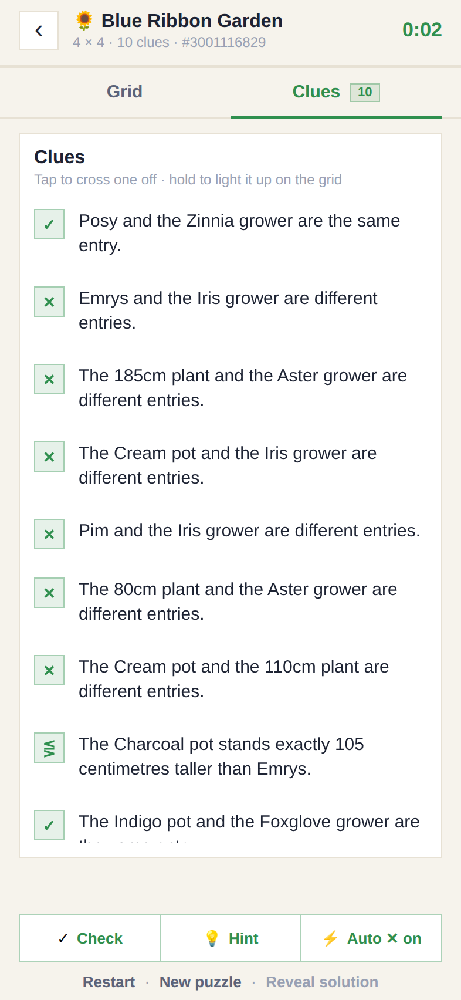
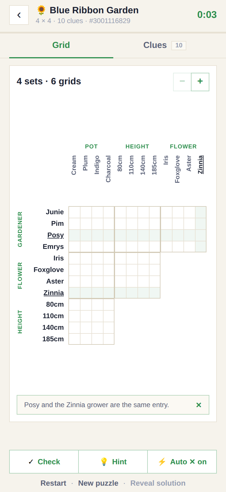
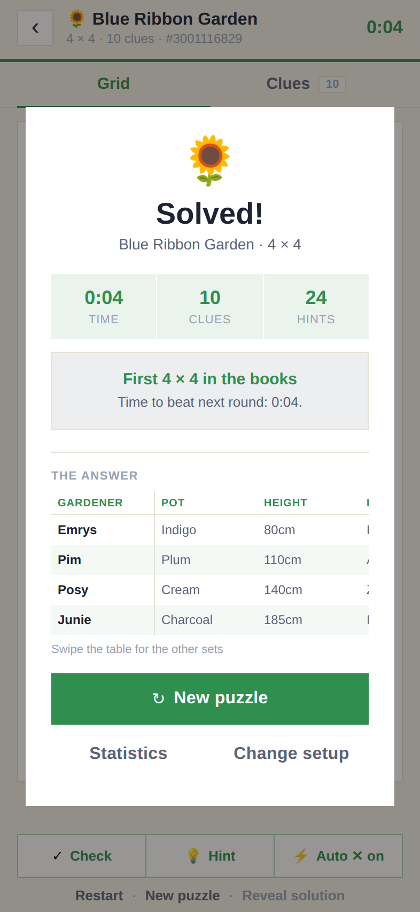
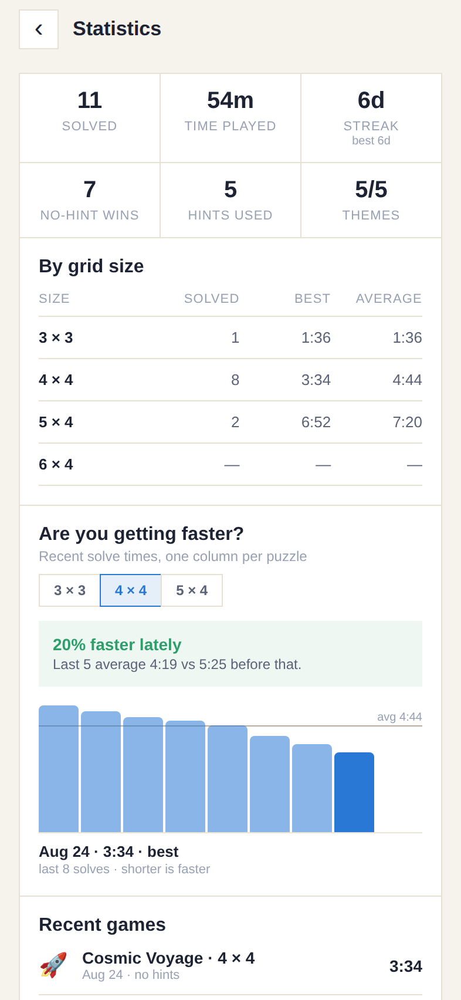
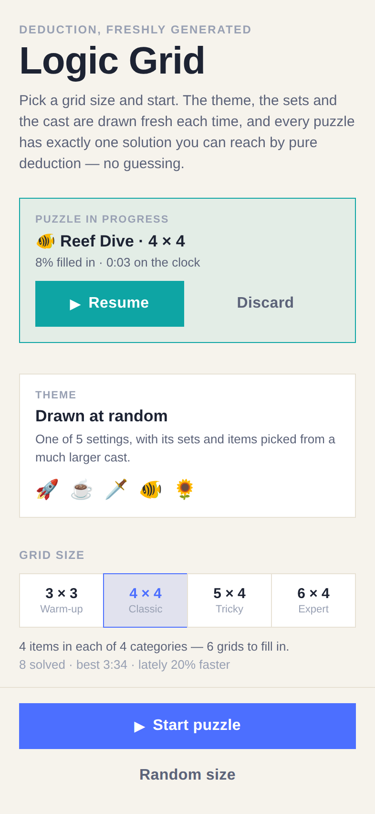

# Logic Grid

An iOS app (React Native + Expo, TypeScript) that generates a fresh logic-grid
deduction puzzle every time you press start. You choose the **grid size**; the
app draws everything else — the theme, the sets in play and the cast of items —
at random.

Every generated puzzle is guaranteed to:

- have exactly one solution, and
- be solvable by pure deduction, so a player never has to guess.

Games in progress survive closing the app, finished games are kept, and the
statistics screen shows whether you are getting quicker.

## Running it

```bash
npm install
npm run ios        # opens the iOS simulator (needs macOS + Xcode)
npm start          # dev server; scan the QR code with Expo Go on a device
npm run web        # browser preview, handy on a machine without Xcode
```

Checks:

```bash
npm test           # jest — puzzle engine, board, storage and statistics
npm run typecheck  # tsc --noEmit
npm run screenshots  # rebuild the screens in docs/screenshots (see below)
```

For a standalone build, use EAS (`npx eas build -p ios`); the bundle identifier
is set in `app.json` and should be changed to your own before building.

## Screens

Captured from the real build at iPhone proportions. **Regenerate these whenever
the UI changes** — `npm run screenshots` — so the reference here always matches
what the app looks like; a change that alters a screen should land with fresh
images in the same commit.

| | | |
|---|---|---|
| <br>**1. Setup** — the grid size is the only choice; the theme is drawn on start. | <br>**2. Grid** — a 4 × 4 puzzle as a 3 × 3 staircase of six grids, sized to fit the tab. | <br>**3. Clues** — the clue list on its own tab, with the count still to be used. |
| <br>**4. Clue focus** — holding a clue lights up its rows and columns and brings you back to the grid. | <br>**5. Solved** — time, hints, how it compares with earlier games, and the answer table. | <br>**6. Statistics** — totals, per-size bests and the trend of recent solve times. |
| <br>**7. Resume** — the setup screen offering the game that was left in progress. | | |

The theme differs from run to run because it is drawn at random, and the
statistics screen is captured with a sample history baked into the script — the
rest is the app behaving normally.

## How you play

1. **Home** — pick a grid size: 3 × 3 (warm-up), 4 × 4 (classic), 5 × 4 (tricky)
   or 6 × 4 (expert). The first number is how many items each category holds, the
   second how many categories take part. The theme is drawn when you press start
   — one of five settings, its sets and its cast sampled from pools of fourteen
   items each, so two puzzles rarely share a line-up. "Random size" rolls the
   shape too.
2. **Game** — the whole puzzle is drawn as one staircase of grids, the way a
   printed logic puzzle is laid out: every pair of sets meets in its own grid,
   so a four-set puzzle is a 3 × 3 arrangement holding six grids, and each grid
   is items × items. The screen has two tabs — **Grid** and **Clues** — so the
   board is never pushed off the top of a scroll to read a clue, and the board
   opens at the size that fits the space the tab gives it. Tap a square to cycle
   it blank → ✕ → ✓. A tick crosses out the rest of its row and column for you,
   and cycling that tick back to blank takes those crosses away with it —
   anything you crossed by hand stays put. The **Auto ✕** button turns the
   implied crosses off. The set names and item labels stay pinned while the
   grids scroll sideways, and − / + resize the squares past the fit.
3. **Clues** — the second tab, with the number still to be used on the tab
   itself. Tap a clue to cross it off once you have used it, or press and hold
   it to light up every row and column it talks about: that takes you to the
   grid, with the clue named in a strip beneath the board until you dismiss it.
4. **Check** highlights any mark that contradicts the solution, **Hint** places
   one true pairing for you, **Restart** wipes the board and the clock without
   changing the puzzle, and the timer stops when the last square is right.
   Finishing shows **the answer as a table**: one row per person, one column per
   set, so the whole solution reads across in a line. The first set stays pinned
   while the others scroll sideways, which keeps every heading on one line.
5. **Come back later** — the board saves itself as you play, so closing the app
   mid-puzzle costs nothing. The home screen offers to resume it, with the clock
   picking up where it left off and the same puzzle in front of you.
6. **Statistics** — solved count, time played, day streak, no-hint wins, a
   per-size table of best and average times, a chart of recent solve times, and
   the list of recent games. Finishing a puzzle shows how that time compares
   with your earlier games at the same size.

## Project layout

```
App.tsx                     screen switching + puzzle generation entry point
scripts/screenshots.mjs     drives the app in a browser to refresh docs/screenshots
src/data/themes.ts          the five themes: categories, item pools, clue wording
src/data/sizes.ts           the four grid sizes
src/puzzle/types.ts         puzzle, clue and theme model
src/puzzle/rng.ts           seeded PRNG (a seed always rebuilds the same puzzle)
src/puzzle/generator.ts     builds a solution, then a minimal clue set for it
src/puzzle/solver.ts        constraint solver: propagation + search
src/puzzle/describe.ts      clue objects → sentences, using each theme's wording
src/game/board.ts           the player's ticks and crosses, hints, win check
src/game/layout.ts          the staircase arrangement + the answer table
src/game/persistence.ts     what gets written to disk, and the guards to read it
src/game/usePersistence.ts  saved game + finished games as React state
src/game/time.ts            duration formatting
src/game/useTimer.ts        elapsed-time hook
src/stats/summary.ts        history → per-size stats, streaks, improvement notes
src/storage/store.ts        the only module that touches AsyncStorage
src/components/             GridBoard, SolutionTable, ClueList, WinOverlay, …
src/screens/                HomeScreen, GameScreen, StatsScreen
src/ui/                     palette, spacing, borders, haptics helpers
```

## How the board is laid out

`src/game/layout.ts` turns a set count into the classic arrangement. Sets 1…N-1
run across the top as columns; sets 0, N-1, N-2 … 2 run down the side as rows.
A block is drawn where a row set meets a column set for the first time, which
leaves the familiar staircase:

```
              Destination   Ship     Launch
   Astronaut     ■■■■       ■■■■      ■■■■
   Launch        ■■■■       ■■■■
   Ship          ■■■■
```

Four sets therefore give a 3 × 3 arrangement of six grids, three sets a 2 × 2
arrangement of three, and five sets a 4 × 4 arrangement of ten — every pair of
sets exactly once, which is what makes cross-referencing possible: a tick in
Astronaut × Ship can be carried into Ship × Launch without leaving the board.

Nothing in the app is rounded and no bordered thing has a gap beside it: the
`radius` scale in `src/ui/theme.ts` is zero throughout, and bordered neighbours
carry `joinLeft` / `joinTop`, a one-pixel negative margin that makes the two
share a single edge rather than each drawing its own. Grid blocks, size cards,
stat tiles, filter pills and the toolbar buttons all sit flush, so a row of them
reads as one ruled table the way a printed puzzle page does.

The game screen holds that staircase and the clue list in two tabs of one
fixed-height layout, with the toolbar pinned below both. Nothing about the
screen scrolls: `fitCellSize` measures the space the tab actually leaves for the
board — width *and* height, from an `onLayout` on the board area rather than
from the window — and picks the largest cell whose whole staircase fits it. The
zoom buttons go up from there, and only a board zoomed past its fit scrolls, in
whichever direction it outgrew. The clue list scrolls inside its own tab when a
puzzle carries more clues than a screen holds.

In `src/game/board.ts` every square records who marked it. A tap by the player
is a `hand` mark; a cross the board adds because a tick rules out the rest of
its row and column is an `auto` mark that remembers the tick it came `from`.
`reconcile` rebuilds the automatic crosses around the hand marks after every
change, and only ever fills a square the player has left alone.

That distinction is the whole point: cycling a tick back to blank drops the
crosses it added, but a cross the player placed by hand stays put — even one the
tick would also have implied, since the tick never claimed that square in the
first place. It is also what lets **Auto ✕** switch the implied crosses off and
on again without touching anything the player did.

`solutionRows` in the same module produces the end-of-game summary: one row per
entity and one column per set, ordered by the ordered set (earliest year,
cheapest bill…) so it reads like the answer key of a printed puzzle. The table
pins its first column and scrolls the rest, so set names never have to wrap.

## How the puzzle engine works

A puzzle has `size` **entities** and a handful of **categories**. Each entity
owns exactly one item from every category and no item is shared, so a solution
is just one permutation per category. Category 0 (the people) is pinned to the
identity permutation, which stops the same arrangement being counted twice under
a relabelling of entities.

**Generating** (`generator.ts`):

1. Draw a theme from the pool, then its categories — always including one ordered
   category (a year, a price, a depth…) so comparison clues are possible — then
   sample the items each category contributes and roll a random solution. Every
   one of those draws comes from the seeded generator, so a seed rebuilds the
   whole puzzle, cast included.
2. Build a pool of clues that are all *true* of that solution:
   - `A is paired with B` / `A is not paired with B`
   - `A is paired with either B or C`
   - `The depth for A is deeper than for B`, optionally with an exact gap
3. Add clues one at a time until propagation alone cracks the grid.
4. Try removing every clue in turn, keeping the removal whenever the puzzle is
   still deducible. What is left is a minimal clue set.

Link clues — the plain *is* and *is not* statements the grid is drawn for — make
up **at least three quarters** of every finished puzzle. That is not something
the offer order can promise on its own, because which clues survive is decided
by the deduction rather than by the pool: a single comparison can do the work of
five crosses and stay in. So the generator spaces the flavour clues out among
the links, drops a redundant comparison before a redundant link when it
minimises, and if the mix still comes out short it builds the puzzle again with
the flavour thinner — down to links alone, which always clears the bar. A few
direct matches lead the pool, since a puzzle carried by links alone otherwise
needs half as many clues again to reach the same certainty.

**Solving** (`solver.ts`) keeps a candidate bitmask per (category, entity) in a
flat `Int32Array` and alternates:

- *propagation* — an item belongs to one entity and an entity to one item, plus
  one rule per clue kind, run to a fixpoint;
- *search* — branch on the most constrained cell, used by `solve()` when
  counting solutions.

Step 3 of generation deliberately uses the propagation-only entry point
(`solveByDeduction`). If pure propagation reaches a full grid, the answer is
provably unique *and* a player can reach it the same way — no guessing, no
backtracking. It is also much cheaper than proving uniqueness by exhaustive
search, which keeps generation at a few hundred milliseconds even for the 6 × 4
expert grids. `solve()` still exists for the tests, which independently confirm
that each generated puzzle has exactly one solution.

### Clue wording

The sentences clues are written in belong to the themes, not to the code. Each
theme can supply templates for the five kinds of clue, filled from named slots:

| Slot | Meaning |
|---|---|
| `{a}` `{b}` `{c}` | the attributes a link or either-or clue names |
| `{greater}` `{lesser}` | the two sides of a comparison |
| `{noun}` | what the ordered set is called, e.g. "launch year" |
| `{comparative}` | which way it runs, e.g. "later" |
| `{gap}` `{unit}` | the exact difference, e.g. "3" and "years" |

So Cosmic Voyage says

```ts
clues: {
  link: '{a} shares a mission with {b}.',
  compare: '{greater} launches {comparative} than {lesser}.',
  compareGap: '{greater} launches exactly {gap} {unit} {comparative} than {lesser}.',
  …
}
```

and reads "The Kestrel launches later than Milo", while Reef Dive says "The
Pipefish spotter went exactly 18 metres deeper than Nico" and Mythic Quest
"Wren is not the Minotaur slayer".

Anything a theme leaves out falls back to `DEFAULT_CLUE_TEMPLATES` in
`describe.ts` ("{a} is paired with {b}."), so a new theme can ship without
writing any of them. `resolveClueTemplates` merges the two at generation and
stores the result on the puzzle, which means a saved game keeps the wording it
was played with even if the theme is rewritten later. A test holds every
template to the slots its clue needs — dropping `{b}` from a link would quietly
halve the clue — and to a capital letter and a full stop.

The item `pattern` on each category (`the {} mission`) is what those slots are
filled with, so the two are written together: change the voice and the patterns
usually want a look as well.

### Seeds

Every new puzzle is given a freshly rolled 32-bit seed, and that seed decides
everything the player did not choose: which theme is drawn, which of its sets
play, which items are sampled from their pools, the solution, and the clues.
`generatePuzzle({ theme, size, seed })` with the same seed and size rebuilds an
identical puzzle — a test asserts exactly that, which is what makes the seed a
fair name for a puzzle rather than a debugging curiosity.

The seed is therefore never re-rolled for a puzzle already in play:

| Action | Seed |
|---|---|
| Start puzzle / New puzzle | a new random seed |
| **Restart** | unchanged — same theme, sets, items, answer and clues; only the board and the clock start over |
| **Resume** | unchanged — the saved puzzle is stored whole and comes back as it was, clock included |

The current seed is printed at the foot of the game screen, so a puzzle worth
repeating can be identified.

## Persistence and statistics

Two things are stored, both under AsyncStorage, both versioned:

| Key | Holds |
|-----|-------|
| `logic-grid:saved-game:v1` | the puzzle in progress: the whole puzzle, every tick and cross, crossed-off clues, elapsed seconds, hints used |
| `logic-grid:history:v1` | the last 300 finished games: time, hints, theme, size, whether it was revealed |

The saved game stores the generated puzzle itself rather than its seed, so a
game in progress keeps playing exactly as it was even if the themes or the
generator change in a later version.

`src/storage/store.ts` is the only module that talks to AsyncStorage. Reads run
through the guards in `persistence.ts`, so data from an older version, a
half-written file, or a corrupt value reads as "nothing saved" instead of
crashing; writes are wrapped too, so a device that refuses to write costs the
player their save and nothing more. The board is written 600ms after each
change, when the app goes to the background, and when the player leaves the
screen; finishing a puzzle clears it.

`src/stats/summary.ts` derives everything shown from the list of finished games
— nothing aggregated is stored, so the numbers can never drift out of sync with
the games behind them. Revealed puzzles are recorded but kept out of the times.
Improvement is measured two ways: `improvementFor` compares a game just
finished with earlier games at the same size (personal best, share faster than
average, rank), and `statsForSize` compares the last five solves with the five
before them for the longer-run trend the chart draws.

## Notes

- The five themes live entirely in `src/data/themes.ts`. Adding one is a matter
  of listing five categories with a pool of items each, marking the ordered
  category, giving each category a `pattern` used to phrase clues
  (`the {} mission`), and optionally a `clues` block to give the theme its own
  voice. The pools hold fourteen items apiece — well over the six a
  6 × 4 puzzle uses — which is what makes the draw feel fresh; a test keeps every
  pool deep, distinct and short enough to fit the grid headings.
- No backend and no analytics: everything is kept on the device, and clearing
  the statistics from the stats screen deletes it.
- `npm run screenshots` exports the app for web, serves that build, drives it in
  Chromium and rewrites `docs/screenshots`. Playwright's Chromium arrives with
  the dev dependencies (`npx playwright install chromium` if the download was
  skipped); `PLAYWRIGHT_CHROMIUM_PATH` points it at another binary, and
  `--skip-build` reuses the last export. **Treat the images as part of the
  build**: regenerate them alongside any change that alters a screen, so the
  README never shows a version of the app that no longer exists.
- `react-dom` / `react-native-web` are installed only so `npm run web` can give
  a quick preview away from a Mac; nothing in the app is web-specific.
