# Every screen

Captured from the real build at iPhone proportions — a 15 Pro, 393 × 852, which
is the middle of the range the app is built for. **Regenerate these whenever the
UI changes** — `npm run screenshots` — so what is here always matches what the
app looks like; a change that alters a screen should land with fresh images in
the same commit. The same walk runs in CI, so a screen the script can no longer
get to fails the build rather than quietly dropping out of this page.

For what the same screens look like on a tablet, see **[On an iPad](ipad.md)**.

| | | |
|---|---|---|
|  **1. Start** — the name on a panel of the link colour, **Daily** and **Play** under it with a rule between, and the two side doors at the foot. |  **2. Difficulty** — the same panel, the same half; only what is under it changes. |  **3. Numbered puzzles** — every puzzle at that difficulty, counting from one, five to a page, each with a box that ticks when you finish it and your time beside it; the glass between **Previous** and **Next** zooms the list out. |
|  **4. Daily** — today's four, one per difficulty. A finished one shows its time and opens the result instead of a board. |  **5. Settings** — seven names with a box or a slider against each, and nothing to read. | 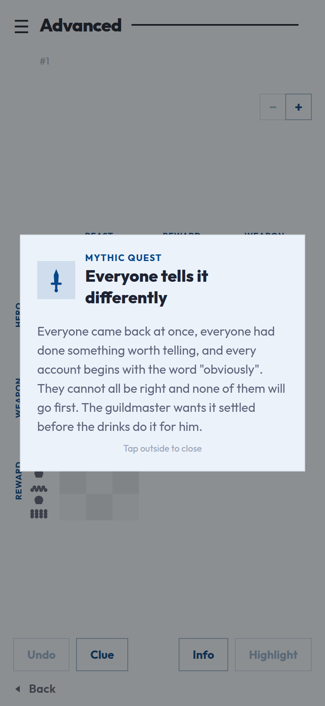 **6. Briefing** — what went wrong and why anybody wants it sorted out. It opens with the puzzle and waits behind **Info** afterwards. |
| 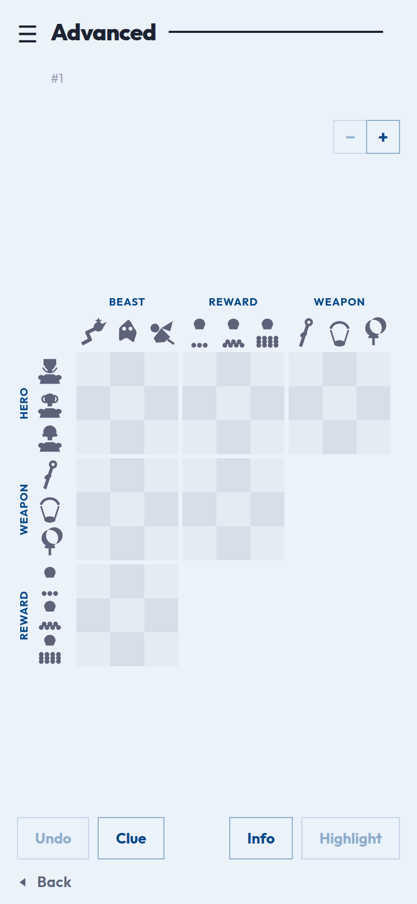 **7. Grid** — a 4 × 4 puzzle as a 3 × 3 staircase of six grids, sized to fit the screen. | 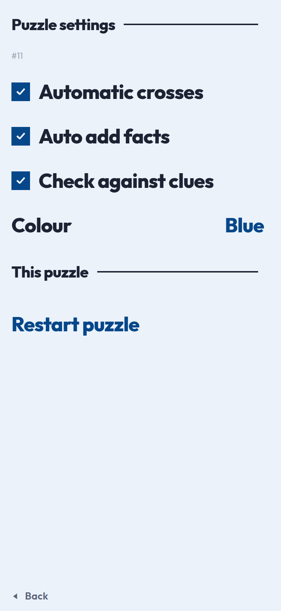 **8. Puzzle settings** — behind the burger: the board pair and the colour, set the way the settings screen sets them, then starting this one over. | 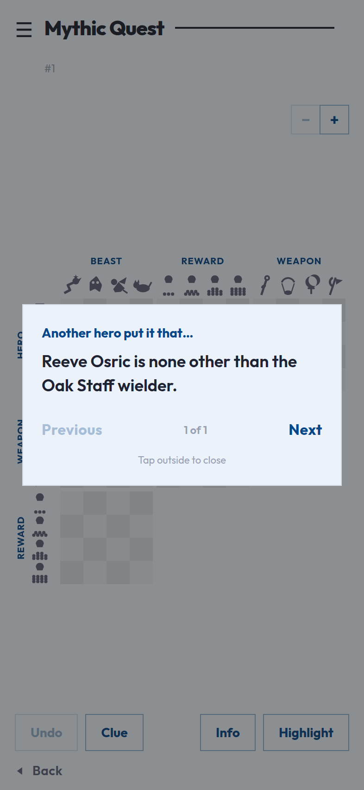 **9. Clue** — one clue at a time, in a window with the room to read it, under a line saying who is supposed to have said it. |
| 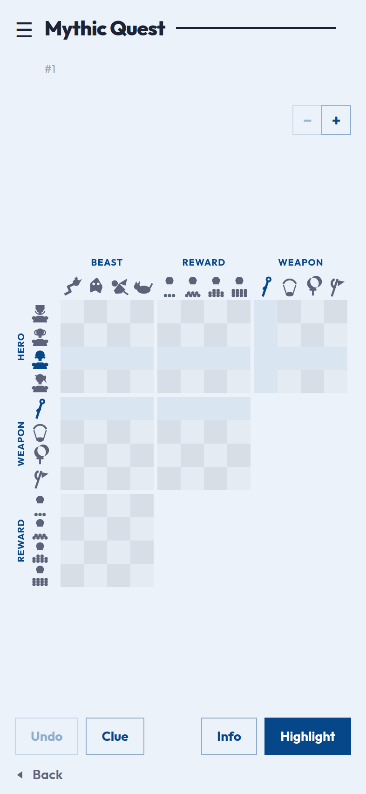 **10. Highlight** — the button at the bottom right lights every row and column the clue talks about. | 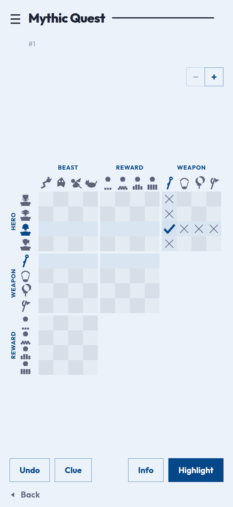 **11. Marked up** — a mark the player made is drawn heavily, one the board worked out for itself lightly. Same shape, same colour: the difference survives being colour-blind. | 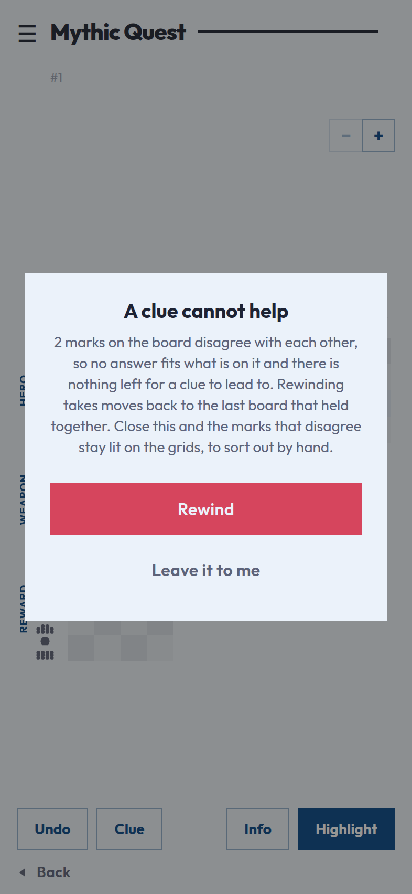 **12. Out of reach** — asking for a new clue checks the board first, and stops with a window offering to rewind when the answer has been marked away. |
| 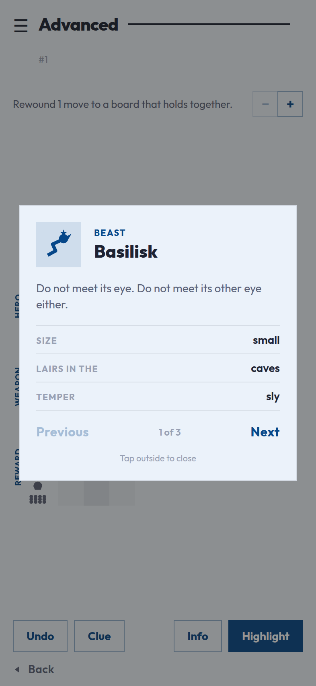 **13. Item card** — tap any picture on the board to meet it, and page through the rest of its set. | 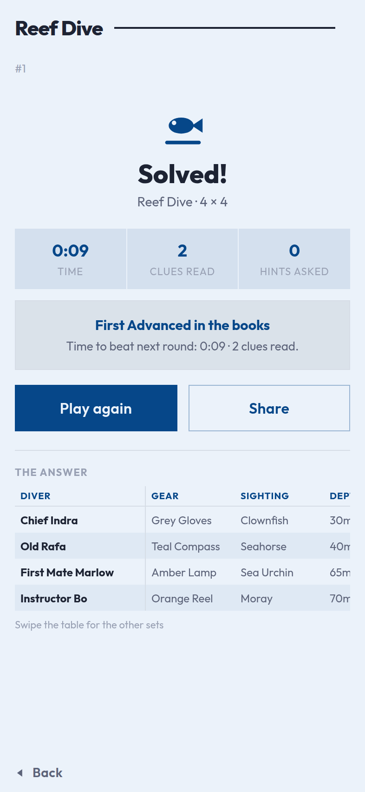 **14. Solved** — the finish takes the screen: time, clues read, how it compares, **Play again** and **Share**, the answer table. | 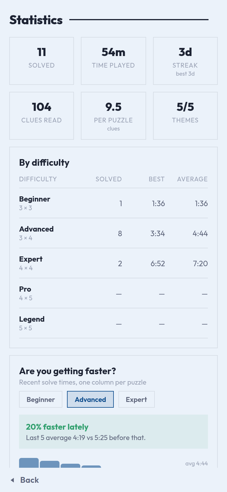 **15. Statistics** — totals, bests by difficulty and the trend of recent solve times. |
| 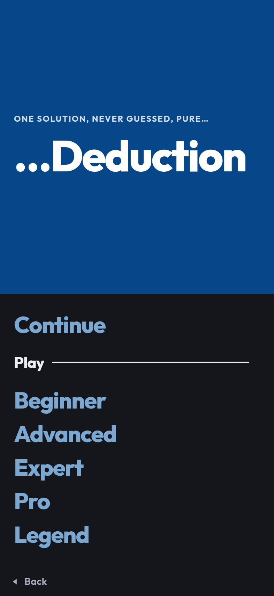 **16. Night** — the difficulties in night colours, with a game waiting behind **Continue**. | 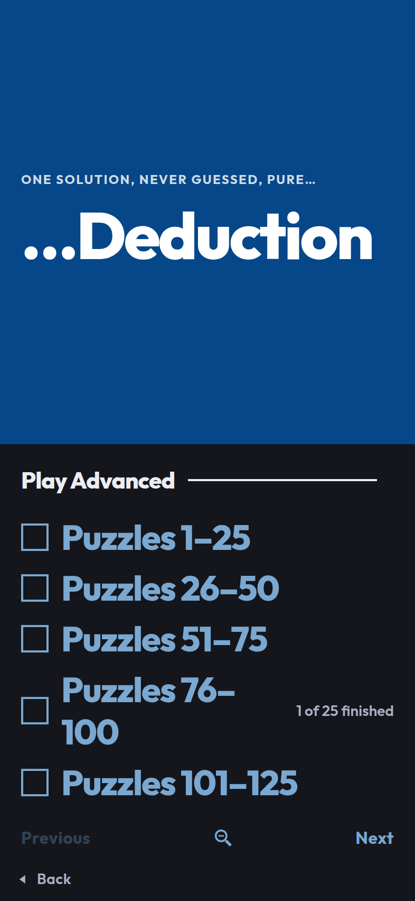 **17. Zoomed out** — the numbered list two presses of the glass out: five rows of twenty-five puzzles, paged the same way, each opening to the pages inside it. | 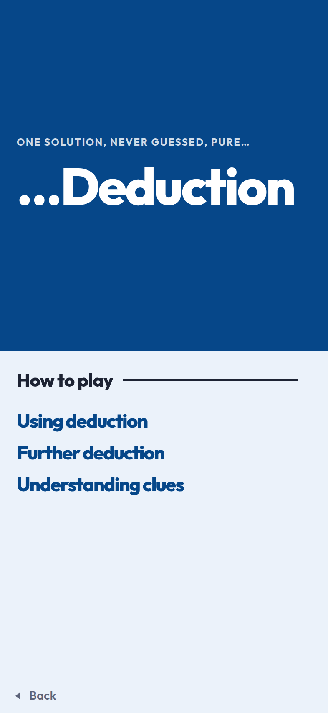 **18. How to play** — the third of the front door's words, and a menu rather than a board: two lessons in deduction and a door to the clues. |

| | | |
| --- | --- | --- |
| 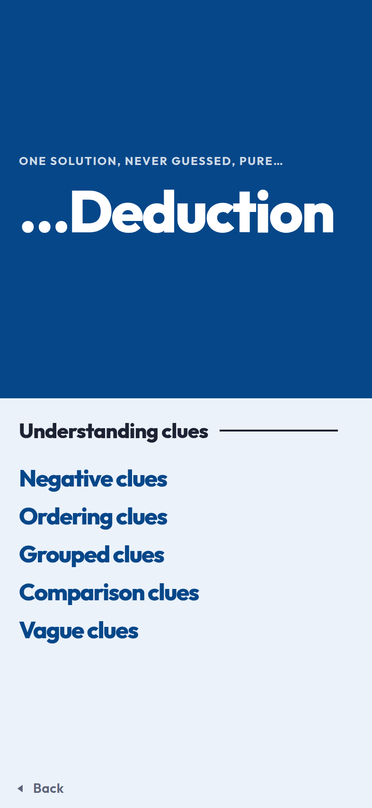 **19. Understanding clues** — one lesson per kind of clue the generator writes. | 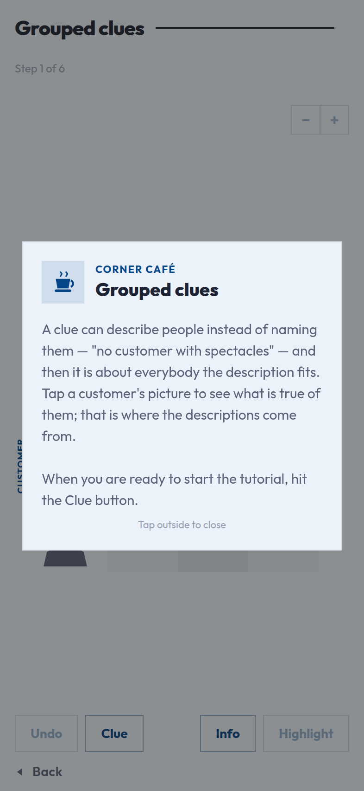 **20. A lesson opens** — what it is about, in the window a puzzle tells its story in, ending with the one thing to do. | 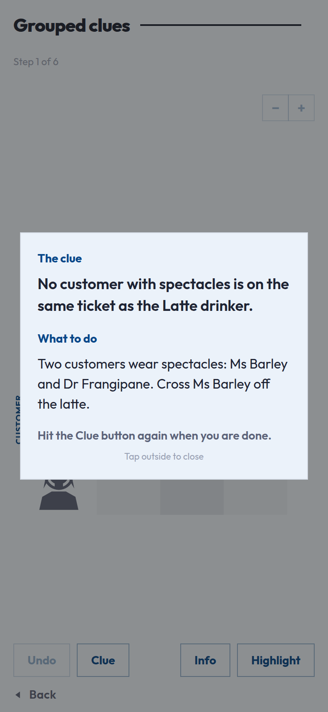 **21. Clue** — the clue, what to do with it, and the press that has it read. |

| | | |
| --- | --- | --- |
| 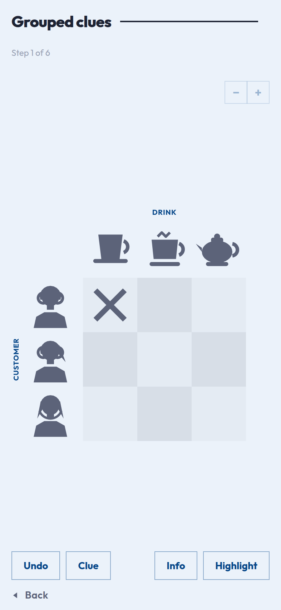 **22. The board** — the game screen exactly: the same header, zoom pair, and four words along the bottom. | 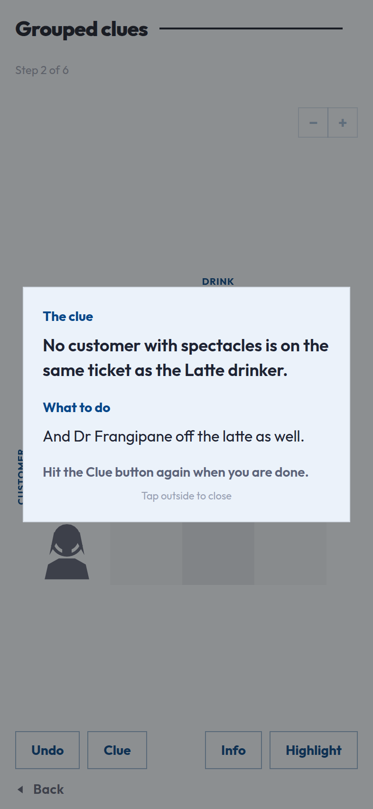 **23. On to the next** — Clue read the board, found it right, and moved straight on. | |

The theme differs from run to run because it is drawn at random, and the
statistics screen is captured with a sample history baked into the script — the
rest is the app behaving normally.
